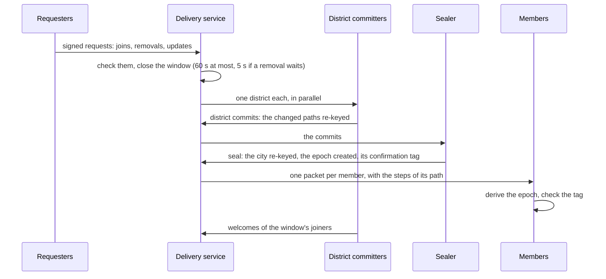

# City‑G

**Post-quantum end-to-end encrypted groups of millions of members.**

[]()
[](docs/specs.md)
[](LICENSE)

City‑G is a research protocol for end-to-end encrypted groups that are too
large, too busy or too often offline for a standard group protocol: up to
`2^24` members, bursts of hundreds of thousands of joins and departures in
one epoch, and groups in which nobody may be online. Its profile,
**`city-g/v0.4`**, keeps the key schedule of MLS (RFC 9420) and changes how
the group is re-keyed. It is post-quantum by default: X-Wing (ML-KEM-768
with X25519) and ML-DSA-65.

> **Status: research.** This repository holds the
> [specification](docs/specs.md), the [design note](docs/design.md), a
> [symbolic model](docs/formal/) and the protocol core
> [`cityg-core`](crates/cityg-core) with an in-memory delivery service. The
> message plane, the networked delivery service and the clients do not exist
> yet ([specification, section 19](docs/specs.md#19-open-items)). There are
> no test vectors and no independent human cryptographic review: **for
> production, use MLS.**

---

## Why

MLS is the IETF standard for end-to-end encrypted groups. It provides
key establishment "for groups in size ranging from two to thousands"
([RFC 9420](https://www.rfc-editor.org/rfc/rfc9420.html)), and messaging
systems that use it "aim to scale to groups with tens of thousands of
members" ([RFC 9750, §6](https://www.rfc-editor.org/rfc/rfc9750.html#section-6)).
At a million members, four of its choices get in the way:

1. **One committer per epoch.** Every epoch comes from one commit by one
   member, and concurrent commits conflict. A burst of 100,000 joins is one
   commit built by one device, or 100,000 epochs in a row.
2. **Everyone processes everything.** Every member downloads every commit
   and keeps the whole public tree, which grows with the group.
3. **Someone must be online.** A joiner can add itself with an external
   commit, but it cannot apply the removal of another member, and a member
   cannot leave on its own: "they must be removed by a remaining member"
   ([RFC 9750, §6.1](https://www.rfc-editor.org/rfc/rfc9750.html#section-6.1)).
4. **Classical cryptography.** The cipher suites of RFC 9420 are classical;
   post-quantum suites are an
   [Internet-Draft](https://datatracker.ietf.org/doc/draft-ietf-mls-pq-ciphersuites/).

## Key ideas

| Idea | What it does |
| --- | --- |
| **Windows** | The delivery service (DS) collects requests for up to 60 s, or 5 s when a removal waits. One epoch seals the whole window, whatever its size. |
| **Districts and a city** | The tree is split into districts of 4,096 leaves under a binary city. Each district a window changes is re-keyed by its own committer, in parallel; a sealer re-keys the city and creates the epoch. The total cost stays within ×1.1 to ×1.3 of the lower bound `D·ln(N/D)` for `D` changes among `N` members. |
| **Taints** | A committer draws secrets for other members' nodes. Every node records who drew it, and removing or updating a member re-keys every node it drew: a removed committer keeps nothing useful. |
| **Anyone can commit** | A committer needs no state of its own: any member of the epoch can commit any district, or seal, from the public state. |
| **Init chain** | As in MLS, each epoch depends on the previous one: the DS alone cannot fabricate an epoch, and a member checks the confirmation tag instead of signatures. |
| **Nobody online** | A joiner or a returning member seals the window itself with an external init, pending removals included; members check its admission and signature when they come back. |
| **Light members** | A member keeps its path and the secrets of its epoch, O(log N), and downloads one packet per window with the steps of its own path. |
| **Checks by sampling** | The DS checks every request, committers the entries of their district, the sealer the structure of every commit, and members audit random entries. |
| **Open groups** | An admin-signed policy can open a group to any device; every join stays visible. |

## City‑G 0.4 and MLS

City‑G keeps the structure of MLS where it can: the init secret chain, the
joiner secret, confirmation tags over the transcript, welcomes and the
external init. It departs from it where a group of millions needs something
else ([specification, section 20](docs/specs.md#20-mls)).

### Design

| | MLS (RFC 9420) | City‑G 0.4 |
| --- | --- | --- |
| Maturity | IETF standard (2023), independent implementations, years of analysis | Research profile, one implementation (this repository), symbolic model and first computational proofs of its key schedule, no independent review |
| Target size | "Two to thousands" (RFC 9420); tens of thousands (RFC 9750) | Up to `2^24` leaves; modelled for `2^20` |
| Cryptography | Classical cipher suites; post-quantum suites in draft, whose hybrid KEM is X-Wing's | X-Wing (ML-KEM-768 with X25519), ML-DSA-65, BLAKE3, ChaCha20-Poly1305 |
| An epoch | One commit by one member | One window of requests, of any size |
| Concurrent changes | Concurrent commits conflict; one is kept | Districts committed in parallel by different members, then one seal |
| Re-key | The committer's own path, encrypted to the resolution of its copath | Every changed path of the window, chained where possible |
| Who knows a node's secret | The members below it; a committer re-keys only its own path | Also the committer that drew it, recorded as its taint |
| What a member stores | The whole public tree | Its path and its epoch's secrets, O(log N) |
| What a member downloads per epoch | The whole commit | One packet with the steps of its own path |
| Leaving | Removed by another member | Its own signed request |
| Nobody online | A joiner adds itself by external commit; removals wait for a member | A joiner or a returning member seals the window, removals included |
| Who validates changes | Every member, every proposal | The DS, the committers and the sealer; members audit samples |
| What a joiner checks | The group information signed by a member | The chain of seals from an admin checkpoint |
| Message plane | Secret tree, encrypted sender data, signed messages | Not specified yet |

### Guarantees

| Property | MLS | City‑G 0.4 |
| --- | --- | --- |
| Group secrets hidden from the DS | Yes | Yes in closed groups. In an open group, anyone can join and read, the DS included, and every join is visible. |
| Secrecy after a removal | From the commit that removes the member | From the window that applies it, which closes at most 5 s after the removal is recorded; until then the DS withholds deliveries, which is not cryptographic |
| Forward secrecy and post-compromise security | Yes | Yes: the init chain, and healing at the device's next update |
| Joiners do not read the past | Yes | Yes |
| Agreement on the membership | Every member holds the tree | Every seal commits to the tree and the registry; the list is read on demand |
| Admission control | Every member validates every addition | In a closed group, the DS cannot add a member. A malicious committer can place an invalid entry: sampled audits catch it with probability about `1 - e^-20`, with a transferable fraud proof |
| Unique keys in the tree | Required ([RFC 9420, §7.3](https://www.rfc-editor.org/rfc/rfc9420.html#section-7.3)) | Unique devices; unique leaf keys not required |
| Forks by the DS | Possible; detected by comparing the epoch authenticator out of band | Possible; detected by comparing the transcript hash out of band. The DS alone cannot fabricate an epoch |
| A malicious committer cuts members off | Possible ([RFC 9420, §16.12](https://www.rfc-editor.org/rfc/rfc9420.html#section-16.12)) | Possible: a committer its district, the sealer the group. They reject the window and re-enter; reports are an open item |
| Messages: sender authenticated, sender hidden from the DS | Yes | Not yet: no message plane |

**In short:** City‑G 0.4 reaches sizes and bursts that MLS was not designed
for, is post-quantum, lets a member leave on its own and lets a group move
on with nobody online. It pays for this with admission checks by sampling,
committers that learn other members' secrets (bounded by taints), and a
message plane that does not exist yet. The research notes below look for a
profile with every guarantee of MLS at this scale.

## How a window works



More diagrams — creating a group, joining, nobody online, coming back — in
[docs/workflows.md](docs/workflows.md).

## Security properties

From the [specification](docs/specs.md), section 2.2, for members that
follow the group. "Epoch secrets" are what the message plane will encrypt
under. The delivery service is passive or active.

| Property | Against the delivery service | Against a removed member | Device state compromised | Device key stolen |
| --- | --- | --- | --- | --- |
| Confidentiality of epoch secrets | yes in a closed group; none in an open group, which anyone can join | yes, from the window that applies its removal | outside the forward-secrecy and post-compromise windows | no, until the device is removed |
| Membership agreement | yes | yes | yes | yes |
| Admission control in a closed group (no member without an admin's admission) | yes | yes | yes | yes, unless the device is an admin |
| Post-removal secrecy | n/a | yes, including for the nodes it drew as a committer | n/a | once the device is removed |
| Forward secrecy | yes | n/a | for the epochs the device erased | yes |
| Post-compromise security | n/a | n/a | after the device's next update | no, until the device is removed |
| Join secrecy | yes | n/a | yes | yes |

Not provided: metadata privacy, availability (the delivery service can deny
service), secrecy from members of the same epoch, and, in an open group,
secrecy from whoever joins it. Every join stays visible, and nobody can
speak as another member. The [symbolic model](docs/formal/README.md) checks
the choices these properties rest on in 18 ProVerif scenarios.

## Numbers

**Measured.** The scale test (`crates/cityg-core/tests/scale.rs`, one core,
release build) builds a full group and runs one window of half removals
and half joins:

| | 16,384 members, 2,000 changes | 65,536 members, 4,000 changes |
| --- | --- | --- |
| Wraps (against the bound `D·ln(N/D)`) | 5,333 (×1.27) | 12,475 (×1.12) |
| District commits | 16, busiest 852 KB | 16, busiest 1.9 MB |
| Seal | 51 KB | 51 KB |
| Packet per member | mean 7.7 KB | mean 8.3 KB |
| DS check of the whole window | 0.8 s | 1.6 s |

**Modelled**, for a group of `2^20` members
([`rekey_sim.py`](docs/research/rekey_sim.py),
[`parity_sim.py`](docs/research/parity_sim.py)):

* **A burst of 100,000 joins and 100,000 departures** in one window: 648,420
  wraps across 256 districts, the busiest commit 6.0 MB; each member
  downloads 11.9 KB.
* **Following the group**, per member and per day, with 60-second windows:
  3.2 MB at 0.1 change per second, 7.4 MB at 1.7 and 10.3 MB at 12.
* **The weak point.** At a million members, departures come every second or
  so, and under the rule that a removal closes its window within 5 s,
  windows last 5 s: following the group then costs about 44 MB a day at
  1.7 changes per second. The research notes bring this down (below).

## Limits

* The delivery service sees the members, the requests and the timing of
  windows.
* Removals take effect when their window is sealed; until then, the delivery
  service enforces them, which is not cryptographic.
* Committers learn the secrets they draw until they erase them; taints make
  a removed committer's knowledge useless, at the cost of re-keying what it
  drew.
* Admission control in a closed group rests, for entries a malicious
  committer places, on sampled audits.
* A committer can wrap a secret that some members cannot open: they reject
  the window and must re-enter. Reports that expose such a committer are an
  open item.
* Members that follow the group check tags, not the history: comparing the
  interim transcript hash out of band detects a fork.
* A stolen device key lets the thief take the member's place by an update
  or a re-entry until the device is removed; the member can then no longer
  follow, and notices. A catch-up gives the thief nothing: its welcome is
  sealed to the member's leaf key too.
* Research code: side channels of the dependencies have not been assessed.

## Research beyond 0.4

The architecture of 0.4 comes from a first research note,
[Groupes de millions de membres](docs/research/grands-groupes-2026-09-25.md).
Eight more, in French, look at what comes next; the fifth gathers them
into a candidate profile for the next version, and the last three work on
its open problems. None of them is part of the profile.

| Note | Question | What it finds |
| --- | --- | --- |
| [A message plane](docs/research/plan-de-messages-2026-09-26.md) | How do a million members send and read messages? | Sender cards with compact signatures, burst chains, committing messages, a sealed message log. |
| [The guarantees of MLS](docs/research/parite-mls-2026-09-26.md) | What must change for every guarantee of MLS at a million members? | An MLS-style message plane with the sender hidden from the DS, unique keys, a mode where the service authorizes joins, a membership log, urgent and ordinary removals: following costs 2.0 MB a day with 5-minute windows. |
| [Re-keying by the server](docs/research/rekey-serveur-2026-09-26.md) | Could the server re-key the tree, with zero-knowledge proofs? | Not without knowing the keys: one that draws them reads every later epoch with one member it removed. Proposes disputes proved in zero knowledge. |
| [Îlots under a flat top](docs/research/ilots-2026-09-26.md) | What is the best re-key technique at this scale? | Small subtrees, relays and joiners that do the work: following costs 94 KB a day with relays and 415 KB without, instead of 1.8 MB for the profile of the previous note, whatever the group's size. A city maintained above the îlots keeps a window that changes one îlot at 30 KB. |
| [Beyond 0.4](docs/research/au-dela-0.4-2026-09-26.md) | What would the next version be, and what is still open? | The 0.4 tree read through relays and re-keyed by small tasks that joiners take on, with the parity profile's authorized mode and message plane: a member who reads 100 messages a day downloads 213 KB instead of 2.1 MB. It can follow 0.4 in three steps. Open, in order: a computational proof, dispute proofs for X-Wing, forks, standards. |
| [Open problems](docs/research/problemes-ouverts-2026-09-26.md) | Which of those open problems can be solved now? | First computational proofs with CryptoVerif, and an assumption the key schedule needs: `Extract` must be a dual PRF. A wrap dispute is about 1.1 million AND gates, about 0.4 MB to prove to the server. Three witnesses out of four against forks, a cache for sender cards. |
| [Proofs and measurements](docs/research/preuves-et-mesures-2026-09-26.md) | What does a dispute really cost, and what would prove the whole tree? | A wrap dispute measured with emp-zk: under a second and 2 MB without its X25519 half, which needs a proof over its own field. Authentication in the computational model. A weakness of 0.4: a stolen device key read every window through catch-ups, unseen; 0.4 now binds the catch-up's welcome to the member's leaf key. A proof plan for the whole tree, with random oracles, and `Extract` as HKDF for the next profile. |
| [The proof of the tree](docs/research/preuve-arbre-2026-09-26.md) | What must be proved for the whole tree, and what already is? | The security game under adaptive corruptions and its safety predicate, executable and checked against 24 formal models; a proof sketch with random oracles whose every step has a mechanized lemma, the taint rule and post-compromise healing among them. The adaptive argument itself remains to be written. |

## Repository

| Path | Content |
| --- | --- |
| [`crates/cityg-core`](crates/cityg-core) | Protocol core without I/O: deterministic CBOR, X-Wing, device identities, hashing and wraps, the tree, re-key plans, the registry, the key schedule, signed requests, district commits and seals, welcomes, members, joiners and returning members, an in-memory delivery service, audits and fraud proofs. |
| [`crates/cityg-pqc`](crates/cityg-pqc) | FIPS 204 ML-DSA-65 with per-usage contexts. |
| [`docs/`](docs/README.md) | Specification, design note, glossary, workflows, symbolic model, research. |
| [`scripts/`](scripts/) | Local CI, security review, delivery-service guardrail. |

## Quick start

```bash
cargo test --workspace                                            # unit and scenario tests
cargo test -p cityg-core --release --test scale -- --ignored --nocapture   # a large window
./scripts/ci/local-ci.sh                                          # everything the CI runs
docs/formal/run.sh /path/to/proverif                              # symbolic model (ProVerif 2.05)
cargo run --release --manifest-path docs/research/bench/Cargo.toml   # primitive costs
python3 docs/research/rekey_sim.py                                # cost model
python3 docs/research/msg_sim.py                                  # cost model of the proposed message plane
python3 docs/research/parity_sim.py                               # cost model of the profile at parity with MLS
python3 docs/research/ilots_sim.py                                # cost model of îlots and of the candidate profile
python3 docs/research/open_problems_sim.py                        # cost model of the open problems
python3 docs/research/safety_predicate.py                         # safety predicate of the tree proof
docs/research/formal-computational/run.sh /path/to/cryptoverif   # computational model (CryptoVerif 2.13)
```

The scenario tests of `crates/cityg-core/tests/scenarios.rs` run whole
groups on the in-memory delivery service: growth over several districts,
windows sealed by an entrant with nobody online, recorded removals, removal
of a committer that kept its secrets, forged epochs, jumps and re-entries,
a stolen device key, failed committers, eviction, audits and fraud proofs,
invites, anchored joins, and open groups.

## Contributing

See [CONTRIBUTING.md](CONTRIBUTING.md). Protocol changes start with the
specification. Report vulnerabilities privately ([SECURITY.md](SECURITY.md)).

## Citation

```bibtex
@misc{cityg2026,
  title={City-G: Post-Quantum End-to-End Encrypted Groups of Millions of Members},
  author={Sabri Haddouche},
  year={2026},
  howpublished={\url{https://github.com/pwnsdx/cityg}},
  note={Protocol specification: profile city-g/v0.4}
}
```

## License

MIT, see [LICENSE](LICENSE). Copyright (c) 2025 Sabri Haddouche.

## Contact

- **Security issues:** pwnsdx@protonmail.ch (PGP available with ProtonMail)
- **Bugs:** GitHub Issues
- **Discussions:** GitHub Discussions

## Acknowledgments

City-G builds on MLS (RFC 9420) and the TreeKEM line of work, on batch
re-keying of multicast key trees and Tainted TreeKEM, on the NIST
post-quantum standards FIPS 203 (ML-KEM) and FIPS 204 (ML-DSA), and on
BLAKE3 and ChaCha20-Poly1305.
