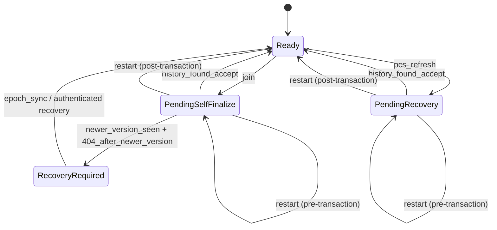

# Client-State Hardening Audit Pack

This pack scopes the crash/restart hardening work added for CityG client state handling, with emphasis on `pending join_finalize`, persisted barrier recovery state, and restart/epoch-sync convergence.

## Critical Invariants

The current hardening work treats these as release-blocking invariants:

1. `barrier_recovery_pending` must never clear without an authenticated resolution path.
2. A persisted pending activation must resolve at most once.
3. `join_finalize` must never reseed `K_fs`.
4. Restart must surface only canonical pre-transaction or post-transaction snapshots.
5. If authenticated history is insufficient, the client must remain `pending` or enter `recovery_required`.
6. Persisted `pending.*` fields must round-trip without silent normalization.

## Minimal Client State Machine



## Persistence and Versioning

| Persisted object | Versioned | Crash-safe expectation | Recovery rule |
| --- | --- | --- | --- |
| `PersistedSession` | Yes (`version`) | Atomic session write + pointer write | Unsupported versions are rejected; legacy fields use explicit fallback paths only |
| `barrier_state.pending` | Yes (within `PersistedSession`) | Persisted before publish for barrier updates | Reloaded verbatim; mismatch must not normalize into activation |
| `barrier_recovery_pending` | Yes | Must survive crash until authenticated resolution | Send/leave/refresh remain blocked while true |
| `last_session_pointer` | Implicit | Atomic pointer update | Dangling pointer is pruned instead of resurrecting stale state |

## Fault Injection Matrix

The client test harness now exposes named cut points covering the session persistence and join-finalize activation path:

| Cut point | Purpose |
| --- | --- |
| `BeforeSessionEncrypt` | Abort before encrypting persisted session payload |
| `AfterSessionEncrypt` | Abort after encryption but before write |
| `AfterTempWriteFsync` | Simulate crash after temp file fsync |
| `BeforeAtomicRename` | Simulate crash before atomic replace |
| `AfterSessionWrite` | Corrupt or truncate the written session file |
| `BeforePointerWrite` | Abort before last-session pointer update |
| `AfterPointerWrite` | Rewrite pointer to missing session target |
| `BeforePublishJoinFinalize` | Persist pending state, then abort before join-finalize publish |
| `AfterPublishBeforeReload` | Abort after join-finalize publish but before local reload |
| `AfterAuthenticatedAcceptBeforePersist` | Abort after authenticated accept but before pending clear persists |
| `AfterPersistBeforePendingClear` | Abort after activated session persist on join-finalize recovery path |

## Coverage Map

Coverage is versioned in [`kat/kat-client-state-manifest-v0.1.4.json`](../kat/kat-client-state-manifest-v0.1.4.json) and validated by `client_state_manifest_is_well_formed_and_complete`.

Primary gate:

```bash
./scripts/verify_client_state_hardening.sh
```

The gate covers:

- deterministic fault-injection tests in `cityg-gui`
- property/state-machine tests in `cityg-gui`
- client-state manifest validation in `msphf-orchestrator`

## Nightly and Staging Artifacts

`cityg-stress` now supports:

- `--client-restart-every-secs`
- `--capture-client-state-artifacts`

Expected artifact bundle contents for restart-chaos runs:

- `restarts.log`
- `client-restarts.log`
- `initial-health.json`, `final-health.json`
- `initial-metrics.txt`, `final-metrics.txt`
- `worker-*-round-*-health.json`
- `worker-*-round-*-metrics.txt`
- `worker-*-round-*-client-state/*.json`
- `server.log`
- `worker-*.log`
- `summary.txt`

The per-session JSON files intentionally store hashed tags for `gid`, `leaf_id`, `we_epoch_id`, `xk_hash`, and key material identifiers instead of raw secrets.

## Audit Mandate

Recommended external review priority:

1. Client persistence and crash/restart logic.
2. `pending join_finalize` and restart/epoch-sync convergence.
3. Protocol/implementation consistency for recovery invariants.

Suggested handoff sequence:

1. Share this pack plus the client-state manifest.
2. Include one nightly-chaos artifact bundle.
3. Ask reviewers to start from the client fault-injection cut points and the restart state machine before reviewing primitives.

## Assumptions and Non-Goals

- No wire-format change is introduced by this hardening work.
- “Client restart” in `cityg-stress` currently means managed harness restart chaos plus client-state artifact capture, not a second independent implementation.
- The property model is a bounded invariant model for CI; it does not replace end-to-end crash/restart tests.
