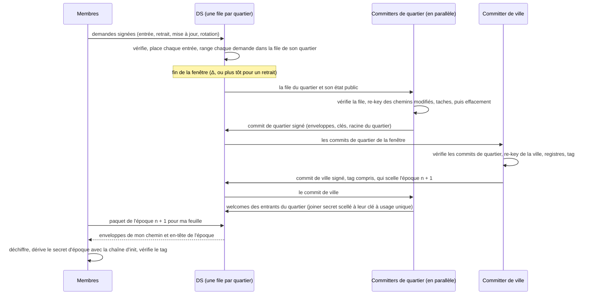

# Groupes de plusieurs millions de membres : état de l'art et architecture « Cité »

| | |
| --- | --- |
| Date | 2026-09-25, révision 2 |
| Nature | Note de recherche. Rien de ce qui est proposé ici n'est implémenté ; le profil en vigueur reste [`city-g/v0.3`](../specs.md) ([note de conception](../design-v0.3.md)). |
| Question | Comment City-G peut-il servir des groupes de millions de membres, où des centaines de milliers de personnes entrent et sortent en même temps, sans que les demandes en attente au service de distribution (DS) deviennent un goulot d'étranglement ? |
| Compagnons | [`rekey_sim.py`](rekey_sim.py) : modèle de coût (`python3 docs/research/rekey_sim.py` redonne tous les chiffres de la section 4, graine fixe, en une minute et demie). [`formal/`](formal/README.md) : modèle ProVerif des choix de sécurité (section 5). [`bench/`](bench/src/main.rs) : mesure du coût CPU des primitives. |
| Auteur | Claude Code (assistant IA d'Anthropic), à la demande du mainteneur. Le modèle symbolique couvre les choix clés, mais il n'existe ni spécification ni preuve calculatoire (feuille de route, section 8). Une relecture cryptographique humaine reste nécessaire avant toute décision. |

Vocabulaire :
- une *enveloppe* est le secret d'un nœud de l'arbre chiffré vers la clé publique d'un enfant : un chiffré X-Wing (1120 octets) et le secret scellé (48 octets) ;
- Δ est la durée d'une fenêtre ;
- N est la taille du groupe ;
- D est le nombre de changements d'une fenêtre (entrées, retraits, mises à jour de clé).

**Ce que change la révision 2**, par rapport à la première version du même jour :

1. **La chaîne d'init est conservée.**
   - Le modèle formel montre ce qu'elle apporte. Elle protège les époques passées quand une clé de feuille fuit, et elle empêche un DS de fabriquer une époque même si le membre ne vérifie que le confirmation tag.
   - Sans elle, il faudrait vérifier une signature à chaque fenêtre.
   - Les welcomes reviennent, scellés par quartier et en parallèle. Le trafic de fond d'un membre est divisé par 2 à 4.
2. **L'en-tête signé d'un commit doit contenir le confirmation tag.** Le modèle a trouvé l'attaque contraire lors d'une entrée.
3. **Plus de KEM multi-destinataires.** Les constructions sur réseaux euclidiens qui partagent l'aléa entre destinataires sont cassées par des clés publiques malveillantes, et un membre choisit sa propre clé de feuille.
4. **Placement des entrées.** Donner aux entrants les feuilles libérées dans la même fenêtre, puis des quartiers libres pour le surplus, réduit une vague de 30 à 43 %.
5. **Vérification des entrées répartie** entre le DS, les committers de quartier et des audits par échantillonnage chiffrés. Le committer de ville ne peut pas vérifier seul un million de signatures.
6. **Nouveaux chiffres :** coûts CPU mesurés, taille des quartiers, latence d'une fenêtre, et modèle ProVerif de douze scénarios.

## 0. Résumé

1. **La v0.3 ne peut pas atteindre l'échelle visée**, pour quatre raisons :
   - sa capacité est plafonnée à 8192 membres ;
   - ses commits sont séquentiels et font entrer au plus 64 membres et en retirer au plus 256 chacun ;
   - chaque membre traite chaque commit ;
   - l'arbre complet d'un million de membres pèserait environ 4,5 Go.

   Une vague de 100 000 entrées et 100 000 départs demanderait 1 563 commits successifs, soit 26 minutes à un commit par seconde. Pendant ce temps, les derniers membres retirés gardent l'accès.
2. **Le travail d'une vague a un coût minimal qu'aucun protocole ne peut éviter.** Remplacer D membres parmi N coûte au moins de l'ordre de D·ln(N/D) chiffrés, et cette borne est atteinte. Pour 200 000 changements dans un groupe d'un million, cela fait de l'ordre de 331 000 chiffrés. Ce qu'on peut choisir :
   - le payer une seule fois par fenêtre ;
   - le répartir entre de nombreux appareils ;
   - garder ce que chaque membre télécharge en O(log N).
3. **Proposition « Cité » :**
   - **Arbre :** un seul arbre de clés, découpé en *quartiers* de 4096 feuilles et surmonté d'une *ville* ; les époques avancent par fenêtres de temps.
   - **Commits :** à la fin d'une fenêtre, un committer par quartier re-keye en parallèle tous les chemins modifiés de son quartier, puis un committer de ville re-keye les niveaux supérieurs. Les committers de quartier scellent ensuite les welcomes des entrants.
   - **Rôles :** aucun rôle ne demande d'état propre ; tout membre qui suit le groupe peut en prendre un.
   - **DS :** il tient une file par quartier, vidée entièrement à chaque fenêtre, et livre à chaque membre uniquement son chemin, comme dans SAIK.
   - **Taches :** chaque nœud garde le nom du committer qui l'a « taché » (Tainted TreeKEM). Retirer ou mettre à jour un membre re-keye aussi ces nœuds.
   - **Registre et entrées :** le registre passe en cartes de Merkle creuses, et des points de contrôle signés par les admins ancrent les entrées.
4. **Chiffres (simulateur, X-Wing et ML-DSA-65, CPU mesuré) :**
   - Un million de membres et 200 000 changements entrent en une seule fenêtre. Le commit du quartier le plus chargé fait 6,0 Mo (0,64 s de CPU), celui de la ville 0,76 Mo. Chaque membre télécharge environ 12 Ko et y passe au plus 8 ms. Le total reste à moins d'un facteur 2 de la borne inférieure.
   - Avec le placement apparié, le total baisse de 30 %.
   - Pour 8,4 millions de membres et un million de changements : un facteur 1,8 de la borne, et environ 13 Ko par membre.
5. **Prix à payer :**
   - un retrait prend effet à la fin de sa fenêtre, soit Δ plus quelques secondes ;
   - les committers voient plus de secrets, d'où le suivi des taches et l'effacement ;
   - les entrées des autres quartiers sont vérifiées par le DS, les committers et des audits, pas par chaque membre ;
   - un membre qui suit tout reçoit de 1 à 10 Mo par jour selon la fenêtre (de 10 min à 1 min), surtout à cause des mises à jour quotidiennes des feuilles.
6. **Suite :** un brouillon de spécification, l'extension du modèle formel à cette spécification, un prototype du re-key multi-chemins et un DS à files par quartier testé en charge.

## 1. Où bloque la v0.3

La v0.3 regroupe déjà les entrées : les demandes attendent au DS et le
prochain commit les place ensemble. Mais tout passe par une seule chaîne de
commits, que chaque membre rejoue.

| Limite | Spécification | Effet à l'échelle visée |
| --- | --- | --- |
| Capacité fixée à la genèse, au plus `MAX_CAPACITY` = 8192 feuilles | 6.1, 16 | Impossible au-delà de 8192 membres. La borne servait à garder une mise à jour sous 10 Mo. |
| Une seule chaîne d'époques : le premier commit valide de l'époque n + 1 gagne, les autres sont refusés et reconstruits | 12.1 | Un seul commit à la fois pour tout le groupe. |
| Au plus 64 entrées et 256 retraits par commit, les plus anciens d'abord | 12.1, 16 | 100 000 entrées et 100 000 retraits demandent 1 563 commits successifs. La file du DS se vide à ce rythme, et un retrait attend tous ceux qui le précèdent. |
| Chaque membre traite chaque commit, dans l'ordre | 13.2, 14.2 | Chaque membre, même léger, télécharge et vérifie 1 563 commits. |
| Arbre complet d'environ 35 Mo pour 8192 membres | 19 | Environ 4,5 Go pour un million. Il faudrait des membres légers partout, et l'auteur d'un commit doit tenir l'arbre complet. |
| Un welcome par entrée, scellé par l'auteur du commit | 10.3 | Tout le travail des entrées d'une époque retombe sur un seul appareil. |
| Registre en listes bornées : 4096 admissions retirées, puis un plancher | 7 | Avec 100 000 retraits par vague, le plancher monte à chaque vague et refuse des admissions encore valides. |
| Feuilles non fusionnées et chemins effacés | 6.4, 19 | Les commits suivants grossissent tant que les membres ne se remettent pas à jour ; l'effet est mesuré pour MLS (section 2.3). |

## 2. Ce que dit la recherche

### 2.1 Bornes inférieures : ce qu'aucun protocole ne peut faire

* **Un changement coûte au moins log2 n chiffrés.** C'est une borne amortie
  par changement de membre (Micciancio et Panjwani, Eurocrypt 2004). Elle
  vaut pour la distribution de clés multicast construite avec du chiffrement
  symétrique, des générateurs pseudo-aléatoires et du partage de secret, et
  elle est atteinte.
* **Remplacer d membres parmi n coûte Ω(d·ln(n/d)) chiffrés.** Cette borne
  est asymptotiquement atteinte, s'applique au multicast comme aux CGKA et
  généralise la précédente (Anastos et al., 2024). Pour 200 000 changements
  dans un groupe de 2^20 membres, elle donne de l'ordre de 331 000 chiffrés
  (avec une constante de 1), soit 387 Mo avec X-Wing, quel que soit le
  protocole.
* **Des mises à jour concurrentes coûtent plus cher.**
  - Si un nombre linéaire de membres se mettent à jour en même temps et veulent guérir vite, la communication devient linéaire en n (Bienstock, Dodis et Rösler, TCC 2020).
  - Guérir en k mises à jour par membre coûte au moins de l'ordre de k·n^(1+1/(k−1))/log k, soit n² pour k = 2 (Auerbach, Cueto Noval, Pascual-Perez et Pietrzak, TCC 2023).
* **Le pire cas est linéaire.**
  - C'est vrai pour toute CGKA construite en boîte noire à partir d'un chiffrement à clé publique (Bienstock et al., TCC 2022).
  - Bartusek, Bitansky, Dodis, Garg et Wu (CRYPTO 2026) obtiennent un pire cas logarithmique sous une hypothèse de réseaux euclidiens (decomposed LWE). Mais leur construction perd la confidentialité persistante, et la variante qui la retrouve rafraîchit en temps linéaire. C'est un résultat théorique, pas une piste d'implémentation.

**Conséquence pour City-G :**
- Le coût total d'une vague est fixé par ces bornes.
- On peut ne le payer qu'une fois par vague, en regroupant les changements.
- On évite les mises à jour concurrentes d'un même nœud en coordonnant les changements plutôt qu'en les fusionnant.
- On peut répartir ce coût entre beaucoup d'appareils.
- On peut garder ce que télécharge chaque membre en O(log N).

### 2.2 La gestion de clés multicast connaît déjà le re-key par lots

* **LKH** (Wong, Gouda et Lam, SIGCOMM 1998) : un arbre de clés. Chaque
  changement renouvelle le chemin de la feuille à la racine, en O(log n)
  messages.
* **Le re-key par lots** (Li, Yang, Gouda et Lam, WWW 2001) :
  - le serveur de clés accumule les entrées et les sorties pendant un intervalle ;
  - il renouvelle ensuite une seule fois l'union des chemins touchés ;
  - c'est bien moins cher que des re-keys individuels, et les clés restent synchronisées avec les données.
* **Iolus** (Mittra, SIGCOMM 1997) : des sous-groupes indépendants, reliés
  par des agents qui rechiffrent le trafic de l'un vers l'autre. Le schéma
  passe très bien à l'échelle, mais les agents voient les messages en clair :
  ce n'est pas du bout en bout.

LKH et le re-key par lots supposent un serveur de clés qui connaît toutes
les clés. TreeKEM, dans MLS comme dans City-G, place des clés publiques aux
nœuds : n'importe quel membre peut re-keyer sans connaître les secrets des
autres. « Cité » reprend le re-key par lots de LKH dans ce cadre.

### 2.3 CGKA et concurrence

| Travail | Idée | Ce qu'on en retient |
| --- | --- | --- |
| MLS, propose-and-commit (RFC 9420) | Des propositions concurrentes, puis un commit qui les applique. | Les nœuds effacés et les feuilles non fusionnées renchérissent les commits. Avec des auteurs tirés au hasard, une seule proposition de mise à jour par commit suffit pour que le coût attendu dépasse √N. Il tend vers N quand les propositions dominent (Auerbach, Cueto Noval, Erol et Pietrzak, 2025). |
| MLS-Cutoff (même article) | Chaque proposition re-keye son propre chemin jusqu'à un point de coupure ; un nœud touché par deux propositions est effacé. | Le coût reste en Θ(log N) avec quelques propositions aléatoires par commit, avec la même sécurité que MLS. Mais il n'y a toujours qu'un commit à la fois. |
| CoCoA (Eurocrypt 2022), DeCAF (2022) | Les mises à jour concurrentes sont fusionnées par rondes. | On chiffre vers des clés en train d'être remplacées : la guérison prend plusieurs rondes (jusqu'à la profondeur de l'arbre pour CoCoA), et CoCoA n'atteint que la sécurité semi-active. |
| FREEK et DMLS (CRYPTO 2023, draft IETF) | Les init secrets sont gardés derrière un PPRF pour traiter des commits hors ordre. | Les forks sont tranchés (le plus grand confirmation tag gagne), pas fusionnés : l'historique reste une chaîne. |
| DCGKA (CCS 2021), BeeKEM (2026) | Pas d'ordre central : ordre causal, ou « clés en conflit » gardées dans l'arbre. | O(n) par opération pour DCGKA ; pire cas linéaire pour BeeKEM. Adapté au pair-à-pair. |
| Tainted TreeKEM (S&P 2021) | Un membre peut re-keyer des nœuds hors de son chemin ; ces nœuds sont *tachés* par lui, et le protocole garde la trace des taches. | Retirer ce membre, ou le guérir, re-keye aussi les nœuds qu'il tache encore. La construction a des preuves contre un adversaire adaptatif. C'est la brique qui permet à un committer de re-keyer pour d'autres. |
| Quarantined-TreeKEM (CCS 2024) | Les clés des membres inactifs sont renouvelées à leur place et protégées par partage de secret. | Une piste pour les membres absents longtemps, nombreux dans un très grand groupe. |

City-G a déjà un DS qui ordonne. Mieux vaut s'en servir pour coordonner et
regrouper les changements, sans lui confier aucun secret, que chercher à
fusionner des mises à jour concurrentes, ce qui coûte plus d'après la
section 2.1. D'où un seul re-key logique par fenêtre, calculé à plusieurs sur
des sous-arbres disjoints.

### 2.4 L'aide du serveur et la bande passante

* **SAIK** (Alwen, Hartmann, Kiltz et Mularczyk, CCS 2022) :
  - l'auteur d'un commit ne signe plus tout le paquet, seulement le confirmation tag, qui lie les secrets et l'état de la nouvelle époque ;
  - le serveur peut donc découper le commit et n'envoyer à chaque membre que sa part ;
  - dans un groupe nouvellement créé de 10 000 membres, un changement d'état coûte au plus 2,7 Ko de téléchargement par membre, contre 1,38 Mo avec le TreeKEM de MLS ;
  - SAIK chiffre en multi-messages et multi-destinataires sur Diffie-Hellman, une construction qui résiste aux clés malveillantes.
* **Chained CmPKE** (Hashimoto, Katsumata, Postlethwaite, Prest et
  Westerbaan, CCS 2021) : des KEM multi-destinataires post-quantiques dont
  les clés partagent un paramètre public, avec une partie commune et 24 à
  128 octets par destinataire.
* **Mais sur réseaux euclidiens, ces KEM tombent face à des clés malveillantes** (Liu, Sotiraki, Tromer et Wang, ASIACRYPT 2025) :
  - une seule clé publique fabriquée à partir de celle d'un destinataire honnête casse la sécurité sémantique pour ce destinataire ;
  - avec assez de destinataires corrompus et une matrice à trappe, l'attaquant retrouve l'aléa partagé, donc les messages de tous les destinataires honnêtes ;
  - les deux attaques sont indétectables.
* **La parade proposée ne tient pas encore.** Le schéma sûr face à ces clés, fondé sur une nouvelle hypothèse (Oracle MLWE), a vu ses paramètres cassés en quelques secondes (Wang, Esgin, Steinfeld, Saarinen et Yiu, 2026). Les paramètres révisés ne gagnent plus qu'un facteur 2,5 environ pour 1000 destinataires, avec un déchiffrement coûteux.
* **KEM actualisable (UKEM).** Il donne la confidentialité persistante aux clés de l'arbre elles-mêmes : chaque chiffré fait avancer la clé du destinataire. Alwen, Fuchsbauer, Mularczyk et Riepel (2025) cassent les UKEM post-quantiques antérieurs dans le modèle qui convient aux messageries, et en proposent un premier sûr sur Module-LWE : clés publiques d'environ 2,3 Ko, chiffrés d'environ 3,1 Ko.
* **FN-DSA** (FIPS 206, pas encore publiée en version finale) : une
  signature fait 666 octets en FN-DSA-512 et 1280 en FN-DSA-1024, contre
  3309 en ML-DSA-65.

### 2.5 Sécurité face aux membres malveillants et vérification

* **Sécurité interne de MLS** (Alwen, Jost et Mularczyk, CRYPTO 2022). Dans MLS, l'intégrité de l'arbre face à un membre malveillant repose sur le *parent hash* : chaque nœud est lié à la feuille du membre qui l'a posé, dans son propre sous-arbre.
  - TreeSync (USENIX Security 2023) et une preuve mécanisée de TreeKEM dans le modèle de Dolev-Yao (2025) couvrent ce mécanisme.
  - Dans « Cité », un committer pose des nœuds hors de son sous-arbre : cet invariant ne tient plus. C'est la tache, liée à la signature du committer, qui le remplace (section 3.5), et cela demande sa propre analyse (section 8).

### 2.6 La pratique aujourd'hui

Dans les grandes messageries, les groupes chiffrés de bout en bout s'arrêtent
vers mille membres : 1000 chez Signal, 1024 chez WhatsApp. Les chaînes
WhatsApp, sans limite de taille, ne sont pas chiffrées de bout en bout. Nous
n'avons trouvé aucune messagerie déployée qui offre un groupe chiffré de bout
en bout d'un million de membres, avec sécurité après compromission et après
retrait. « Cité » vise donc une case vide : c'est de la recherche appliquée,
pas un portage.

## 3. L'architecture « Cité »

### 3.1 Vue d'ensemble

Le groupe est un seul arbre binaire de clés, comme en v0.3, dont la largeur
double quand il le faut. Les l = 12 premiers niveaux forment des *quartiers* :
des sous-arbres de 4096 feuilles. Les niveaux au-dessus forment la *ville*.

```
                          racine
                    /                \                 ville : niveaux l+1 à H,
               ...                      ...            un committer de ville
        /             \           /            \
  quartier 0     quartier 1 ... quartier K-2   quartier K-1
  (4096 feuilles)                                      quartiers : niveaux 1 à l,
                                                       un committer par quartier
```

Chaque nœud porte trois informations :
- sa clé publique ;
- son haché ;
- sa *tache* : l'occupation `[leaf, since]` du committer qui a produit son secret actuel.

Chaque feuille est un membre, décrit comme en v0.3. Un groupe d'au plus 4096
membres n'a qu'un quartier : son committer fait aussi office de committer de
ville, et le groupe se comporte presque comme en v0.3. La taille des
quartiers borne le coût d'un commit (au plus environ 12 Mo et 1,35 s de CPU,
quand tout le quartier change), comme la capacité de 8192 le faisait en
v0.3, mais sans borner la taille du groupe. La section 4.3 discute ce choix
de 4096.

Une fenêtre se déroule en trois phases :



### 3.2 Des époques par fenêtres

* **Ouverture et fermeture :**
  - une fenêtre s'ouvre au premier changement enregistré ;
  - elle se ferme au plus tard Δ_max après, un paramètre du groupe qui borne le délai de retrait ;
  - elle se ferme plus tôt, au bout de Δ_min, si un retrait attend et que le groupe exige des retraits rapides ;
  - une fenêtre vide ne crée pas d'époque.
* **Scellement :** l'époque n + 1 est scellée par le commit de ville, qui couvre tous les commits de quartier de la fenêtre.
* **Pas de plafond par commit :** un commit de quartier vide toute sa file, soit au plus ses 4096 feuilles.
* **Délai de retrait :** un retrait enregistré pendant une fenêtre prend effet à l'époque suivante, soit après au plus Δ plus le temps des phases, quelques secondes même pour les plus grandes vagues (section 4.4).

### 3.3 Re-key multi-chemins en chaîne et calendrier de clés

Quels nœuds changent, et comment :
* **Nœuds renouvelés.** Chaque ancêtre d'une feuille modifiée (entrée, retrait, mise à jour, rotation) reçoit un nouveau secret dans la fenêtre. Aucun autre nœud ne change.
* **Chaînage.** Un nœud renouvelé tire son secret de celui d'un de ses enfants renouvelés, par dérivation à sens unique, comme les path secrets de TreeKEM. Ce secret est enveloppé vers l'autre enfant, avec la nouvelle clé de celui-ci s'il est aussi renouvelé.
* **Deux niveaux sans chaînage.** Juste au-dessus des feuilles, les secrets sont ceux des membres. Juste au-dessus des racines de quartier, pour le committer de ville, ce sont ceux des committers de quartier. À ces deux niveaux, le committer ne connaît le nouveau secret d'aucun enfant : il tire un secret frais et l'enveloppe vers les deux enfants.
* **Retraits et entrées.** Une feuille retirée devient vide et ne reçoit rien. Une feuille qui entre reçoit tout son chemin dans la fenêtre : il n'y a ni feuille non fusionnée ni chemin effacé.
* **Clés.** Comme en v0.3 (section 6.5), la clé publique d'un nœud dérive de son secret.

Le calendrier de clés reste celui de la v0.3 (section 8), avec la racine de
la fenêtre à la place du commit secret :

```text
joiner_secret(n+1) = ExpandLabel(Extract(init_secret(n), racine(n+1)), "joiner", H(GroupContext(n+1)))
epoch_secret(n+1)  = DeriveSecret(joiner_secret(n+1), "epoch")
```

La première version de cette note supprimait la chaîne d'init. Le modèle
formel (section 5) montre ce qu'elle apporte :

* **Confidentialité persistante.** Un adversaire qui vole plus tard la clé de feuille d'un membre retrouve, à partir du trafic enregistré, les racines passées que cette clé ouvrait, mais pas les secrets d'époque, qui dépendent aussi des init secrets effacés. Le scénario `forward_secrecy` est prouvé. Sans la chaîne, toutes les époques depuis la dernière mise à jour de la feuille tombent (`forward_secrecy_without_init`).
* **Authenticité face au DS.** Sans init secret, le DS ne peut pas produire de confirmation tag valide. Un membre peut donc se contenter de vérifier le tag à chaque fenêtre, sans signature (`fabrication` prouvé). Sans la chaîne, le DS enveloppe une racine de son choix vers la feuille d'un membre et calcule le tag lui-même (`fabrication_without_init`) : il faudrait alors vérifier une signature à chaque fenêtre (`fabrication_without_init_signed`), ce qui double ou quadruple le trafic de fond (section 4.5).

Ce que la chaîne d'init impose :
* **Des welcomes.** Un entrant ne connaît pas `init_secret(n)`. Une fois le commit de ville publié, le committer de son quartier, membre de l'époque n, calcule `joiner_secret(n+1)` et le scelle à la clé à usage unique de la demande d'entrée. C'est une enveloppe par entrant, faite en parallèle par quartier : 38 à 61 ms de CPU par quartier dans les plus grandes vagues simulées. Le secret d'entrée est prouvé (`join`).
* **Un rattrapage en deux modes (section 3.7).** Un membre absent rejoue chaque fenêtre manquée, ou saute au présent grâce à un welcome de rattrapage.
* **Un tag signé.** Le welcome n'est pas signé. L'en-tête signé du commit de ville doit donc contenir le confirmation tag, sinon le DS remplace à la fois le welcome et le tag et fait entrer le nouveau venu dans une époque qu'il connaît (`anchored_join_unsigned_tag`). La v0.3 le fait déjà, puisque le tag est dans le GroupInfo signé.

Enfin, un committer peut tirer ses secrets frais de `KDF(son aléa, init_secret(n), nœud)` : c'est une défense en profondeur contre un mauvais aléa, face à un adversaire extérieur.

C'est le re-key par lots de LKH, avec le chaînage de TreeKEM. Son coût reste
à un facteur 1,5 à 2,7 de la borne inférieure (section 4).

### 3.4 Des committers sans état propre

* **Committer de quartier.**
  - Ce qu'il lui faut : l'état public de son quartier (clés, feuilles, hachés et taches, environ 18 Mo) et sa file.
  - Ce qu'il fait :
    - il vérifie les signatures de sa file, soit 0,1 à 0,16 s dans les plus grandes vagues ;
    - il re-keye son quartier, soit au plus 1,35 s ;
    - il signe son commit ;
    - il scelle les welcomes de ses entrants une fois le commit de ville publié.
  - Le commit de quartier contient les changements appliqués, les enveloppes, les nouvelles clés publiques et taches, la nouvelle racine (clé et haché) et les insertions et suppressions dans les cartes globales (section 3.8).
* **Committer de ville.** Il vérifie la signature et la structure de chaque commit de quartier : taches égales au signataire, cartes cohérentes. Il re-keye ensuite la ville, calcule le haché d'arbre, le transcript et le confirmation tag, puis signe un en-tête qui contient le tag.
* **Qui peut tenir un rôle.** Il suffit d'être membre de l'époque en cours et de la suivre. N'importe quel membre peut donc prendre n'importe quel rôle.
  - Le DS attribue les rôles de chaque fenêtre parmi des membres volontaires et bien connectés, en préférant les plus stables.
  - Il remplace un committer qui ne livre pas avant l'échéance.
  - La règle C-03 de la v0.3 reste : un committer ne figure jamais parmi les membres qu'il retire, et un membre dont le retrait est demandé ne reçoit pas de rôle.
* **Retrait jamais reporté.** Si un quartier a un retrait en attente et qu'aucun committer ne livre, le committer de ville re-keye lui-même ce quartier. C'est le même travail, sur un état public. Un retrait n'est donc jamais reporté de plus d'une fenêtre.

### 3.5 Taches et effacement

Un committer connaît les secrets des nœuds qu'il re-keye pour les autres.
S'il est malveillant et les garde, il peut lire les époques suivantes même
après son retrait. C'est l'attaque que Tainted TreeKEM traite, et que le
modèle retrouve (`taint_without_rule`). Les règles :

* **Tache publique et intègre.** Chaque nœud porte la tache de son secret actuel, publique et hachée avec l'arbre. La tache de tout nœud renouvelé par un commit est le signataire de ce commit, et tout vérificateur la contrôle. Sans ce contrôle, un committer pourrait inscrire un autre nom et échapper à la règle suivante.
* **Retrait.** Retirer un membre re-keye son chemin et tous les nœuds qu'il tache encore (`taint` prouvé).
* **Mise à jour.** La mise à jour d'un membre re-keye son chemin et ses taches : sa guérison après compromission couvre aussi ce qu'il a vu comme committer (`post_compromise` prouvé).
* **Effacement.** Un committer honnête efface les secrets produits hors de son propre chemin dès que son commit est envoyé. Une compromission ultérieure de l'appareil ne révèle alors que son chemin, comme pour tout membre.

Le coût reste borné par un quartier (au plus 6 143 enveloppes, environ
12 Mo) ou par la ville :
- Dans la simulation, retirer le committer du quartier le plus chargé juste après une fenêtre de 200 000 changements coûte 2 693 enveloppes (6,0 Mo), soit un commit de quartier de plus.
- Pire cas : si une vague retire des committers de tous les quartiers qui ont encore des taches, il faut re-keyer tout l'arbre, soit environ 2N enveloppes.

Deux choses réduisent ce risque :
- une tache disparaît dès que quelqu'un d'autre re-keye le nœud, ce qui arrive souvent dans les niveaux hauts ;
- on choisit comme committers des membres stables : admins, membres de longue date, appareils toujours en ligne.

### 3.6 Les files du DS et le placement des entrées

* **Une file par quartier.** Le DS peut se partager par quartier : un rédacteur par quartier et un pour la ville, au lieu d'un par groupe.
* **Réception.** Le DS vérifie à la réception ce qu'il vérifie aujourd'hui : signatures, admissions, invitations, unicité des demandes en attente. Pour une vague de 100 000 entrées et 100 000 retraits, cela fait environ 63 s de CPU, réparties sur ses serveurs.
* **Placement.** Le service de placement choisit la feuille de chaque entrant, et ce choix pèse sur le coût (section 4.2).
  - D'abord, un entrant prend une feuille libérée par un retrait de la même fenêtre : les deux changements partagent alors un seul chemin.
  - Ensuite, le surplus d'entrants remplit des quartiers libres, à la suite.
  - Un retrait, une mise à jour ou une rotation va dans la file du quartier du membre.
* **Vidage complet.** Toute la file part dans la prochaine fenêtre. Il n'y a plus de plafond par commit, de course entre entrants, de commit externe ni de 409 à reconstruire.
* **Débit.** Il est borné par le coût total du re-key (section 2.1), réparti entre les committers de quartier qui travaillent en parallèle. Le commit de ville ne dépend que du nombre de quartiers : au plus 3 071 enveloppes pour 2 048 quartiers.
* **Un DS malveillant** peut mal placer, ce qui coûte, ou retarder et refuser, ce qui nuit à la disponibilité, comme aujourd'hui. Il ne peut ni lire ni forger.

### 3.7 Livraison par membre et rattrapage

* **Paquet par membre.** Pour chaque époque, le DS assemble :
  - les enveloppes du chemin du membre ;
  - l'en-tête de l'époque (numéro, hachés d'arbre et de transcript, tag) ;
  - pour un entrant, son welcome et l'en-tête signé.

  Le membre dérive le secret d'époque avec son init secret et vérifie le tag, ce qui suffit contre le DS. Il peut en plus :
  - vérifier les signatures de certaines fenêtres, pour l'imputabilité ;
  - contrôler les clés de son chemin contre le haché d'arbre, pour 32 octets par niveau.
* **Rattrapage par rejeu.** Un membre absent rejoue chaque fenêtre manquée : son paquet, environ 7 Ko avec le tag seul. Il lit ainsi tous les messages de son absence, comme en v0.3.
* **Rattrapage par saut.** Le membre publie une clé à usage unique signée par son appareil. Dans la fenêtre suivante, le committer de son quartier lui scelle le joiner secret, comme à un entrant, et la dernière enveloppe de chaque nœud de son chemin lui redonne ses secrets de chemin.
  - Coût : au plus H enveloppes (20 pour un million de membres), un welcome et la chaîne des hachés de transcript, à 32 octets par époque manquée, quelle que soit la durée d'absence.
  - Les messages des époques sautées restent illisibles : c'est la confidentialité persistante.
* **Entrants.** Ils reçoivent leur paquet, leur welcome et l'en-tête signé ; ils vérifient les signatures et l'ancrage (section 3.8).

### 3.8 Ensembles globaux, admins et ancrage des entrées

* **Le registre devient des cartes de Merkle creuses** : les admissions retirées (indexées par haché d'admission, qui expirent avec l'admission) et les identifiants d'appareil (unicité). Leurs racines vont dans le GroupContext.
  - Chaque commit de quartier liste ses insertions et suppressions ; le committer de ville les fusionne et publie les nouvelles racines.
  - Si un même appareil entre dans deux quartiers la même fenêtre, le commit de quartier le plus tardif est refusé. Seul un DS ou un committer fautif peut provoquer ce conflit.
  - Il n'y a plus de plafond ni de plancher.
* **Opérations globales.** Les admins, les changements d'admin, les invitations et leurs révocations passent par le commit de ville ; ces opérations sont rares.
* **Points de contrôle.** Un admin signe régulièrement un couple (époque, haché de transcript), et les invitations portent le plus récent.
  - L'entrant vérifie la chaîne des en-têtes signés, du point de contrôle jusqu'à son époque d'entrée. Il contrôle les signatures de committers membres, avec leurs preuves de feuille.
  - Cela lève la limite « Entering a group » de la v0.3 (section 2.3 de la spécification ; les *anchored joins* avaient été laissés de côté en v0.3). Un DS ne peut plus fabriquer une époque pour un entrant sans la signature d'un membre : `anchored_join` est prouvé, et l'attaque revient sans l'ancrage (`join_without_anchor`).
  - Coût : pour un point de contrôle horaire avec Δ = 60 s, environ 60 en-têtes, 270 Ko et 13 ms de CPU.

### 3.9 Qui vérifie quoi

Le committer de ville ne peut pas revérifier seul toutes les entrées d'une
grande vague : deux signatures par entrée, c'est 42 s de CPU pour
100 000 entrées et 210 s pour 500 000. La vérification est donc répartie :

| Vérification | Qui | Coût |
| --- | --- | --- |
| Toutes les demandes : signatures, admissions, invitations, unicité | Le DS, à la réception | 2 signatures par entrée, réparties sur ses serveurs |
| La file de son quartier | Le committer de quartier, avant de re-keyer | 0,1 à 0,16 s par quartier dans les plus grandes vagues |
| Chaque commit de quartier : signature, structure, taches, cartes | Le committer de ville, avant de signer | Une signature par quartier, 0,43 s pour 2 048 quartiers |
| Le confirmation tag et le transcript de chaque époque suivie | Chaque membre | Un MAC par fenêtre |
| Les signatures des en-têtes | Les entrants, les membres qui sautent au présent, et chaque membre de temps en temps | 0,2 ms par signature |
| Les entrées de toute la fenêtre, par échantillonnage | Chaque membre actif, sur quelques entrées tirées au hasard | Voir la section 4.6 |

Une entrée invalide est signée par le committer qui l'a placée. C'est une
preuve transférable, qui déclenche le retrait du fantôme et celui du
committer. Avec un audit où chaque entrée est vérifiée en moyenne par 20
membres, une fraude échappe à tous avec une probabilité de 2·10⁻⁹. Pour une
vague de 100 000 entrées dans un groupe d'un million de membres actifs,
chaque membre vérifie alors deux entrées, soit 22 Ko.

Un DS qui refuse de servir une entrée échantillonnée est vu comme tel, mais
ce refus n'est pas prouvable. C'est le problème de disponibilité des
données, qui ne se règle pas sans redondance.

C'est le principal recul par rapport à la v0.3, où chaque membre complet
vérifie chaque entrée : la vérification des autres quartiers devient
répartie et probabiliste, avec une probabilité d'échec chiffrée.

### 3.10 Bande passante : ce qui marche et ce qui ne marche pas

* **KEM multi-destinataires : écarté pour l'instant.**
  - Les enveloppes vers des clés de feuille ne peuvent pas partager d'aléa, puisque chaque membre choisit la sienne. Un membre malveillant lirait les enveloppes des autres membres du même commit, en toute discrétion (section 2.4).
  - Celles vers des clés de nœud le pourraient, puisqu'une clé de nœud dérive d'un secret. Elles forment 60 à 80 % des enveloppes.
  - Mais un committer malveillant peut publier une clé piégée. Il faudrait donc que les membres comparent chaque clé de leur chemin à la clé publiée, et qu'une clé contestée ne serve à personne avant d'être refaite.
  - Le gain serait d'environ un quart de la taille des commits et de 60 % de ce que télécharge un membre, au prix d'un schéma hors norme dont la sécurité reste à établir. C'est à réévaluer à l'étape R5.
* **FN-DSA-1024 (1280 octets) au lieu de ML-DSA-65 (3309 octets)**, une fois FIPS 206 finalisée.
  - Il servira surtout aux messages, qui portent chacun une signature.
  - Les membres ne vérifient plus de signature à chaque fenêtre.
* **UKEM**, une piste pour plus tard. Il donnerait la confidentialité persistante aux clés de feuille sans mise à jour quotidienne, pour des chiffrés environ 2,7 fois plus gros.

### 3.11 Pistes écartées

* **Supprimer la chaîne d'init** (première version de cette note) : moins de confidentialité persistante, et une signature à vérifier à chaque fenêtre (section 3.3).
* **Des sous-groupes v0.3 indépendants (groupe de groupes)** : un message doit être chiffré pour chaque sous-groupe, soit O(K) par message, ou relayé par des agents qui le voient en clair (Iolus).
* **Fusionner des mises à jour concurrentes** (CoCoA, DCGKA, BeeKEM) : c'est plus cher d'après la section 2.1, et inutile quand un DS peut ordonner.
* **DMLS** : il rend les forks sûrs à trancher, mais l'historique reste séquentiel.
* **Chiffrer à plat vers chaque membre du quartier** (à la Chained CmPKE) : moins cher quand presque tout le quartier change, mais 4096 enveloppes par quartier touché en charge normale. C'est une optimisation possible pour les quartiers entièrement neufs, à évaluer à l'étape R3.
* **Des committers à plusieurs, qui combinent leurs aléas**, pour qu'aucun ne connaisse seul un secret : la clé publique d'un nœud dérive de son secret entier, et aucun KEM standard ne permet de la calculer à plusieurs sans calcul multipartite.

## 4. Chiffres

Le modèle de [`rekey_sim.py`](rekey_sim.py) suppose :
- des changements tirés au hasard, dont la moitié sont des retraits, dans un arbre plein ;
- des quartiers de 2^12 feuilles ;
- des commits qui comptent leurs enveloppes, les nouvelles clés publiques, un en-tête de 200 octets et la signature.

Ce qu'un membre télécharge comprend les enveloppes de son chemin et
l'en-tête de l'époque. C'est une moyenne sur 20 000 membres.

Les coûts CPU viennent de [`bench/`](bench/src/main.rs), mesurés sur un cœur
d'un Xeon à 2,1 GHz, en build release, par les mêmes chemins de code que
`cityg-core` :

| Opération | Coût |
| --- | --- |
| Clé X-Wing d'un nœud (dérivée d'un secret) | 95 µs |
| Enveloppe (X-Wing et AEAD) | 156 µs |
| Ouverture d'une enveloppe | 320 µs |
| Signature ML-DSA-65 | 0,83 ms |
| Vérification ML-DSA-65 | 0,21 ms |

### 4.1 Vagues

**Un million de membres** (2^20, 256 quartiers) :

| Changements D | Quartiers touchés | Commit du quartier le plus chargé | Commit de ville | Tous les commits | Enveloppes / borne D·ln(N/D) | Par membre : enveloppes (moy. / max), octets | Retrait du committer le plus chargé | Commits successifs en v0.3 |
| ---: | ---: | --- | --- | ---: | ---: | --- | --- | ---: |
| 100 | 81 | 34 env., 83 Ko | 247 env., 510 Ko | 3,3 Mo | ×1,58 | 4,2 / 10, 5 Ko | 51 env., 119 Ko | 1 |
| 1 000 | 250 | 88 env., 208 Ko | 383 env., 761 Ko | 25 Mo | ×1,55 | 6,2 / 12, 7 Ko | 105 env., 244 Ko | 8 |
| 10 000 | 256 | 402 env., 922 Ko | 383 env., 761 Ko | 170 Mo | ×1,59 | 7,9 / 14, 9 Ko | 417 env., 953 Ko | 79 |
| 100 000 | 256 | 1 816 env., 4,1 Mo | 383 env., 761 Ko | 937 Mo | ×1,77 | 9,5 / 17, 11 Ko | 1 828 env., 4,1 Mo | 782 |
| 200 000 | 256 | 2 683 env., 6,0 Mo | 383 env., 761 Ko | 1,4 Go | ×1,96 | 10,0 / 18, 12 Ko | 2 693 env., 6,0 Mo | 1 563 |
| 500 000 | 256 | 4 070 env., 9,0 Mo | 383 env., 761 Ko | 2,3 Go | ×2,74 | 10,6 / 19, 13 Ko | 4 078 env., 9,0 Mo | 3 907 |

**Huit millions de membres** (2^23, 2 048 quartiers) :

| Changements D | Quartiers touchés | Commit du quartier le plus chargé | Commit de ville | Tous les commits | Enveloppes / borne | Par membre | Retrait du committer le plus chargé | Commits successifs en v0.3 |
| ---: | ---: | --- | --- | ---: | ---: | --- | --- | ---: |
| 10 000 | 2 040 | 124 env., 289 Ko | 3 071 env., 6,1 Mo | 242 Mo | ×1,55 | 7,9 / 15, 9 Ko | 142 env., 328 Ko | 79 |
| 100 000 | 2 048 | 501 env., 1,1 Mo | 3 071 env., 6,1 Mo | 1,6 Go | ×1,59 | 9,5 / 17, 11 Ko | 518 env., 1,2 Mo | 782 |
| 1 000 000 | 2 048 | 2 069 env., 4,6 Mo | 3 071 env., 6,1 Mo | 8,7 Go | ×1,81 | 11,1 / 20, 13 Ko | 2 082 env., 4,7 Mo | 7 813 |

Lecture :
* **Membres.** À N fixé, ce qu'un membre télécharge croît comme log D : 4 enveloppes pour 100 changements, 10 pour 200 000. Une vague de 200 000 changements entre en une époque au lieu de 1 563. Si le membre vérifiait les signatures et le haché d'arbre à chaque fenêtre (première version), ce serait 10 à 21 Ko au lieu de 5 à 13 Ko.
* **Coût total.** Il reste entre 1,5 et 2 fois la borne inférieure jusqu'à ce que 20 % du groupe change en une fenêtre. Quand la moitié du groupe change, le facteur monte à 2,7, mais il faut alors de toute façon re-keyer presque tout l'arbre.
* **Taille des commits.** Un commit de quartier reste sous 9 Mo dans ces scénarios, et monte à environ 12 Mo au plus si tout un quartier change. Celui de ville ne dépend que du nombre de quartiers : 0,76 Mo pour 256 quartiers, 6,1 Mo pour 2 048.
* **Welcomes.** Ils ajoutent une enveloppe par entrant, soit 1,2 Ko, répartie entre les committers de quartier.

### 4.2 Placement des entrées

Les tailles sont celles de tous les commits de la fenêtre, avec entre parenthèses le commit du quartier le plus chargé.

| Vague | Au hasard | Appariées aux retraits | Quartiers libres | Appariées, puis quartiers libres |
| --- | --- | --- | --- | --- |
| 2^20 membres, 100 000 entrées, 100 000 retraits | 1,4 Go (6,0 Mo) | 995 Mo (4,4 Mo), −30 % | 1,1 Go (11,8 Mo) | 995 Mo (4,4 Mo), −30 % |
| 2^20 membres, 150 000 entrées, 50 000 retraits | 1,5 Go (6,2 Mo) | 1,3 Go (5,6 Mo) | 910 Mo (12,0 Mo) | 849 Mo (12,2 Mo), −43 % |
| 2^23 membres, 500 000 entrées, 500 000 retraits | 8,7 Go (4,6 Mo) | 5,7 Go (3,3 Mo), −34 % | 6,3 Go (11,9 Mo) | 5,7 Go (3,3 Mo), −34 % |

Pourquoi ces gains :
- Apparier une entrée à un retrait de la même fenêtre fait des deux changements un seul changement de feuille.
- Remplir des quartiers libres à la suite coûte environ 1,5 enveloppe par entrant, contre 3 à 11 par changement au hasard selon la taille de la vague. En contrepartie, un quartier neuf est entièrement re-keyé (environ 12 Mo, 1,35 s).
- Ce que télécharge un membre change peu : 9 à 10 enveloppes en moyenne.

### 4.3 Taille des quartiers

| Groupe, vague | Quartier | Commit de quartier max (CPU) | Commit de ville (CPU) | État d'un committer de quartier |
| --- | --- | --- | --- | --- |
| 2^20, 200 000 | 2^10 | 1,6 Mo (0,17 s) | 3,0 Mo (0,55 s) | 4,6 Mo |
| 2^20, 200 000 | 2^11 | 3,1 Mo (0,34 s) | 1,5 Mo (0,28 s) | 9,2 Mo |
| 2^20, 200 000 | 2^12 | 6,0 Mo (0,64 s) | 0,76 Mo (0,14 s) | 18 Mo |
| 2^20, 200 000 | 2^13 | 11,7 Mo (1,26 s) | 0,38 Mo (0,07 s) | 37 Mo |
| 2^23, 1 000 000 | 2^11 | 2,5 Mo (0,26 s) | 12,2 Mo (2,21 s) | 9,2 Mo |
| 2^23, 1 000 000 | 2^12 | 4,6 Mo (0,50 s) | 6,1 Mo (1,10 s) | 18 Mo |
| 2^23, 1 000 000 | 2^13 | 9,0 Mo (0,96 s) | 3,0 Mo (0,55 s) | 37 Mo |

Ce que montre le tableau :
- La taille des quartiers ne change pas ce que télécharge un membre.
- Elle répartit le travail entre les committers de quartier et celui de ville. L'équilibre est vers 2^11 pour un million de membres et vers 2^12 à 2^13 pour huit millions.
- 2^12 est un bon défaut entre 1 et 8 millions. Le paramètre peut être fixé à la genèse, ou changer quand le groupe double.

### 4.4 CPU et latence d'une fenêtre

Plus grandes vagues simulées, sur un cœur :

| Rôle | Travail | Durée |
| --- | --- | --- |
| Committer de quartier | Vérifier sa file (2 signatures par entrée) | 0,10 à 0,16 s |
| Committer de quartier | Re-keyer le quartier le plus chargé ; un quartier entier au pire | 0,50 à 0,64 s ; 1,35 s |
| Committer de ville | Vérifier les commits de quartier et re-keyer la ville | 0,14 s (2^20) à 1,10 s (2^23) |
| Committer de quartier | Sceller les welcomes de ses entrants | 38 à 61 ms |
| Membre | Ouvrir 20 enveloppes et dériver 20 clés de nœud | 8,3 ms |
| DS | Vérifier toutes les demandes d'une vague de 200 000 | environ 63 s réparties sur ses serveurs |

Un commit de 6 à 12 Mo part en 1 à 2 s à 50 Mbit/s. Une fenêtre se scelle
donc en quelques secondes après sa fermeture, même pour les plus grandes
vagues, et le délai de retrait vaut Δ plus ces quelques secondes. Ce
calcul suppose des committers de bureau bien connectés : un téléphone ne
devrait pas prendre de rôle.

### 4.5 Régime permanent

Pour un membre qui suit chaque fenêtre (2^20 membres) : volume par jour, en
vérifiant une signature à chaque fenêtre (sans chaîne d'init), ou le tag
seul (avec chaîne d'init).

| Changements par seconde | Fenêtre Δ | D par fenêtre | Enveloppes par membre et par fenêtre | Signature à chaque fenêtre | Tag seul |
| ---: | ---: | ---: | ---: | ---: | ---: |
| 0,1 | 10 s | 1 | 1,0 | 46 Mo | 12 Mo |
| 0,1 | 60 s | 6 | 1,7 | 9,0 Mo | 3,2 Mo |
| 0,1 | 10 min | 60 | 3,8 | 1,3 Mo | 0,7 Mo |
| 1,7 | 10 s | 17 | 2,8 | 65 Mo | 30 Mo |
| 1,7 | 60 s | 102 | 4,2 | 14,7 Mo | 7,4 Mo |
| 1,7 | 10 min | 1 020 | 6,2 | 2,1 Mo | 1,1 Mo |
| 12 | 10 s | 120 | 4,4 | 92 Mo | 46 Mo |
| 12 | 60 s | 720 | 5,9 | 21 Mo | 10,3 Mo |
| 12 | 10 min | 7 200 | 7,6 | 2,4 Mo | 1,3 Mo |

Pour situer ces rythmes :
- 0,1 changement par seconde fait 8 640 par jour, soit 0,8 % d'un million de membres.
- 12 changements par seconde, c'est ce que coûte la mise à jour quotidienne de toutes les feuilles d'un million de membres (`FS_WINDOW` de la v0.3).
- 1,7 changement par seconde correspond à une mise à jour hebdomadaire.

Ce qu'on en tire :
* **Longueur de la fenêtre.** Avec Δ = 10 s, il y a 8 640 fenêtres par jour ; avec Δ = 10 min, 144, pour un délai de retrait de 20 minutes au plus.
* **Tag seul.** Vérifier le tag plutôt qu'une signature divise le volume par 2 à 4 ; c'est le gain de la chaîne d'init.
* **Cadence des mises à jour.** Avec la chaîne d'init, la confidentialité persistante ne dépend plus des mises à jour de feuille : leur cadence règle seulement la guérison après compromission. Passer d'une mise à jour quotidienne à une mise à jour hebdomadaire ramène le régime des mises à jour de 12 à 1,7 changement par seconde.
* **Côté DS.** Un million de membres qui suivent tout avec Δ = 60 s représentent 3 à 10 To par jour. Les membres qui ne suivent pas tout sautent au présent quand ils reviennent (section 3.7).
* **Les messages coûtent autant.** Chaque message porte une signature de 3,3 Ko que chaque lecteur télécharge. À un message par minute, cela fait 4,8 Mo par jour et par lecteur.

### 4.6 Audits par échantillonnage

Chaque membre actif vérifie quelques entrées de la fenêtre tirées au hasard,
à 11,2 Ko et 0,4 ms par entrée. Si chaque entrée est vérifiée en moyenne par
k membres, une entrée invalide échappe à tous avec une probabilité de
e^(−k).

| Entrées de la fenêtre | Membres actifs | k | Probabilité d'échapper | Entrées vérifiées par membre | Octets par membre |
| ---: | ---: | ---: | ---: | ---: | ---: |
| 100 | 100 000 | 20 | 2·10⁻⁹ | 0,02 | 224 o |
| 100 000 | 100 000 | 10 | 4,5·10⁻⁵ | 10 | 112 Ko |
| 100 000 | 100 000 | 20 | 2·10⁻⁹ | 20 | 224 Ko |
| 100 000 | 1 000 000 | 10 | 4,5·10⁻⁵ | 1 | 11 Ko |
| 100 000 | 1 000 000 | 20 | 2·10⁻⁹ | 2 | 22 Ko |

## 5. Modèle formel

[`formal/`](formal/README.md) contient un modèle ProVerif de douze scénarios,
chacun sur deux fenêtres et des arbres de deux à quatre feuilles.
`docs/research/formal/run.sh` les exécute en quelques secondes et compare
chaque verdict à celui attendu. Tous sont conformes.

| Scénario | Question | Résultat |
| --- | --- | --- |
| `taint` | Un committer malveillant, retiré, lit-il l'époque suivante ? | Non (prouvé) |
| `taint_without_rule` | Et si l'on re-keye seulement son chemin ? | Oui (attaque) |
| `post_compromise` | Un committer compromis guérit-il en se mettant à jour ? | Oui (prouvé) |
| `forward_secrecy` | La fuite tardive d'une clé de feuille expose-t-elle une époque passée, avec la chaîne d'init ? | Non (prouvé) |
| `forward_secrecy_without_init` | Et sans la chaîne d'init ? | Oui (attaque) |
| `fabrication` | Le DS peut-il faire accepter une époque qu'il connaît à un membre qui ne vérifie que le tag ? | Non (prouvé) |
| `fabrication_without_init` | Et sans la chaîne d'init ? | Oui (attaque) |
| `fabrication_without_init_signed` | Sans chaîne d'init, mais avec une signature vérifiée ? | Non (prouvé) |
| `join` | L'entrant d'un welcome de quartier, dont l'état fuit ensuite, expose-t-il l'époque d'avant ? | Non (prouvé) |
| `anchored_join` | Le DS peut-il faire entrer quelqu'un dans une époque fabriquée, malgré l'ancrage ? | Non (prouvé) |
| `anchored_join_unsigned_tag` | Et si le tag n'est pas signé ? | Oui (attaque) |
| `join_without_anchor` | Et sans ancrage, comme en v0.3 ? | Oui (attaque) |

Le modèle est symbolique : la primitive d'enveloppe y est idéale, ce qui
cache les attaques algébriques de la section 2.4. Les quartiers y ont deux
feuilles, et l'attribution des rôles est donnée. Le README du modèle détaille
ces limites.

## 6. Garanties : ce qui change par rapport à la v0.3

| Propriété | v0.3 | « Cité » |
| --- | --- | --- |
| Taille du groupe | Au plus 8192 | Des millions (simulé jusqu'à 2^23) |
| Changements par époque | Au plus 64 entrées et 256 retraits | Toute la file de chaque quartier |
| Délai de retrait | Le prochain commit, mais derrière toute la file : 26 min pour une vague de 200 000 à un commit par seconde | La fin de la fenêtre, soit Δ plus quelques secondes, quelle que soit la vague |
| Sécurité après compromission | Mise à jour du membre, puis commit par un membre honnête | Pareil ; la mise à jour re-keye aussi les nœuds que le membre tache (prouvé sur un exemple) |
| Confidentialité persistante | Chaîne d'init ; annoncée hors d'une fenêtre `FS_WINDOW` | Chaîne d'init, prouvée sur un exemple même avec une clé de feuille ancienne ; les committers effacent |
| Secrets qu'un appareil connaît | Son chemin | Son chemin ; un committer connaît en plus, jusqu'à effacement, les nœuds qu'il re-keye (tachés par lui) |
| Authenticité d'une époque face au DS | Signature du commit et tag | Tag, grâce à la chaîne d'init ; signatures pour l'imputabilité, les entrants et le rattrapage |
| Vérification des entrées | Chaque membre complet vérifie tout ; les membres légers font confiance au DS pour le haché d'arbre | Le DS vérifie tout ; chaque committer vérifie sa file ou les commits de quartier ; les membres font des audits par échantillonnage ; une fraude est signée, donc prouvable |
| Entrée dans le groupe | L'entrant fait confiance au DS pour son époque d'entrée (section 2.3) | Ancrée sur un point de contrôle signé par un admin (prouvé sur un exemple) |
| État d'un membre | Arbre complet (35 Mo à 8192 membres) ou membre léger | Son chemin (O(log N)), son init secret et les en-têtes |
| Rattrapage après une absence | Rejouer chaque commit | Rejouer chaque fenêtre (environ 7 Ko chacune), ou sauter au présent pour au plus H enveloppes et un welcome |
| Commits concurrents | Le premier gagne, les autres sont refaits | Aucun conflit : sous-arbres disjoints, un seul committer de ville |
| Welcomes | Un par entrée, tous scellés par l'auteur du commit | Un par entrée, scellés par quartier et en parallèle |
| Registre | Listes bornées et plancher | Cartes de Merkle creuses, sans plafond |
| Primitives | X-Wing, ML-DSA-65 | Les mêmes ; FN-DSA quand FIPS 206 paraîtra ; aucun KEM multi-destinataires |

## 7. Risques et questions ouvertes

1. **Pas de preuve calculatoire.** Le modèle symbolique couvre les règles clés sur de petits arbres, mais il faut encore :
   - un modèle de la future spécification entière ;
   - une analyse de la sécurité interne (tache et signature à la place du parent hash, section 2.5) ;
   - idéalement une preuve dans la lignée de Tainted TreeKEM.
2. **Disponibilité des committers.**
   - Il faut des volontaires bien connectés dans chaque quartier. Les rôles sans état propre permettent de remplacer tout de suite un committer défaillant, mais une fenêtre peut s'allonger.
   - Un committer malveillant qui accepte le rôle puis ne livre pas ralentit le groupe jusqu'à son remplacement.
3. **Vérification répartie.** Les audits ne valent que si assez de membres actifs y participent. Un DS peut refuser de servir une entrée : c'est visible, mais pas prouvable.
4. **Trafic.** De 1 à 10 Mo par jour pour un membre qui suit tout, selon la fenêtre, et des To par jour côté DS pour un million de membres actifs. Les messages coûtent autant ou plus : FN-DSA dès que possible.
5. **Membres absents longtemps.** Une clé de feuille ancienne expose les époques futures tant qu'elle n'est pas renouvelée, mais plus les époques passées. Quarantined-TreeKEM et les UKEM sont des pistes.
6. **Métadonnées.** Le DS voit la structure, les placements et le rythme des changements, comme aujourd'hui.
7. **Complexité.**
   - Il y a trois phases par fenêtre, des taches, des cartes creuses, des points de contrôle et des audits : la spécification et l'implémentation grossissent.
   - Un groupe d'au plus 4096 membres reste un seul quartier, au comportement proche de la v0.3.
8. **Placement adverse.** Un DS qui concentre les entrées dans quelques quartiers grossit leurs commits (au plus environ 12 Mo chacun), sans rien apprendre.

## 8. Feuille de route

La v0.3 reste le profil en vigueur. « Cité » serait un nouveau profil, qui
ne serait adopté qu'après les étapes R1 et R2 ; on n'y migrerait pas les
groupes v0.3.

| Étape | Livrable | Critère de sortie |
| --- | --- | --- |
| R1 | Une note `docs/design-v0.4.md` et un brouillon de profil `city-g/v0.4-draft`, qui couvrent : fenêtres et phases, commits de quartier et de ville, taches et leur intégrité, welcomes de quartier, rattrapage par rejeu et par saut, paquets par membre, cartes creuses, points de contrôle, audits et règles du DS | Relecture ; vecteurs d'un exemple à deux quartiers |
| R2 | Étendre [`formal/`](formal/README.md) à la spécification : quartiers de quatre feuilles et plus, chaînage dans un quartier, cartes creuses, chaîne d'en-têtes d'un point de contrôle ; puis une analyse calculatoire de la sécurité interne | Verdicts attendus, sanity checks compris |
| R3 | Un prototype dans `cityg-core` : re-key multi-chemins d'un quartier, taches, welcomes de quartier, vérification d'un paquet | Les coûts de la section 4.4 retrouvés à ±20 % |
| R4 | Côté DS : files par quartier, placement apparié, fenêtres, attribution et remplacement des committers, audits ; puis un test de charge | 2^20 membres simulés et 200 000 changements scellés en une fenêtre, en moins de Δ + 10 s |
| R5 | Bande passante : FN-DSA quand FIPS 206 paraît ; suivi des UKEM ; KEM multi-destinataires limité aux clés de nœud, avec la vérification des clés de chemin | Décision documentée |

## 9. Sources

Bornes inférieures :
* D. Micciancio, S. Panjwani, [Optimal Communication Complexity of Generic Multicast Key Distribution](https://www.iacr.org/archive/eurocrypt2004/30270154/final.pdf), Eurocrypt 2004.
* M. Anastos et al., [The Cost of Maintaining Keys in Dynamic Groups with Applications to Multicast Encryption and Group Messaging](https://eprint.iacr.org/2024/1097), 2024.
* A. Bienstock, Y. Dodis, P. Rösler, [On the Price of Concurrency in Group Ratcheting Protocols](https://eprint.iacr.org/2020/1171), TCC 2020.
* B. Auerbach, M. Cueto Noval, G. Pascual-Perez, K. Pietrzak, [On the Cost of Post-Compromise Security in Concurrent Continuous Group-Key Agreement](https://eprint.iacr.org/2023/1123), TCC 2023.
* A. Bienstock et al., [On the Worst-Case Inefficiency of CGKA](https://eprint.iacr.org/2022/1237), TCC 2022.
* J. Bartusek, N. Bitansky, Y. Dodis, R. Garg, D. J. Wu, [Fair-Weather No More: Guaranteed Efficiency in Secure Group Messaging](https://eprint.iacr.org/2026/1677), CRYPTO 2026.

Gestion de clés multicast :
* C. K. Wong, M. Gouda, S. S. Lam, [Secure group communications using key graphs](https://dl.acm.org/doi/10.1145/285243.285260), SIGCOMM 1998.
* X. S. Li, Y. R. Yang, M. G. Gouda, S. S. Lam, [Batch Rekeying for Secure Group Communications](https://archives.iw3c2.org/www10/cdrom/papers/pdf/p521.pdf), WWW 2001.
* S. Mittra, [Iolus: a framework for scalable secure multicasting](https://www.semanticscholar.org/paper/Iolus:-a-framework-for-scalable-secure-multicasting-Mittra/53fcb9276d05b1f676bbd116a44537960f0878a0), SIGCOMM 1997.

CGKA et concurrence :
* B. Auerbach, M. Cueto Noval, B. Erol, K. Pietrzak, [Continuous Group-Key Agreement: Concurrent Updates without Pruning](https://eprint.iacr.org/2025/1035), 2025 (MLS-Cutoff).
* J. Alwen et al., [CoCoA: Concurrent Continuous Group Key Agreement](https://eprint.iacr.org/2022/251), Eurocrypt 2022.
* J. Alwen et al., [DeCAF: Decentralizable Continuous Group Key Agreement with Fast Healing](https://eprint.iacr.org/2022/559), 2022.
* J. Alwen, M. Mularczyk, Y. Tselekounis, [Fork-Resilient Continuous Group Key Agreement](https://eprint.iacr.org/2023/394), CRYPTO 2023 ; [draft-kohbrok-mls-dmls](https://datatracker.ietf.org/doc/draft-kohbrok-mls-dmls/).
* M. Weidner, M. Kleppmann, D. Hugenroth, A. R. Beresford, [Key Agreement for Decentralized Secure Group Messaging with Strong Security Guarantees](https://eprint.iacr.org/2020/1281), CCS 2021.
* Ink & Switch, [Group Key Agreement with BeeKEM](https://www.inkandswitch.com/keyhive/notebook/02/) ; [BeeKEM: Decentralized, Secure and Efficient Group Key Agreement](https://eprint.iacr.org/2026/1434.pdf), 2026.
* K. Klein, G. Pascual-Perez, M. Walter et al., [Keep the Dirt: Tainted TreeKEM, Adaptively and Actively Secure Continuous Group Key Agreement](https://eprint.iacr.org/2019/1489), IEEE S&P 2021.
* C. Chevalier, G. Lebrun, A. Martinelli, A. R. Taleb, [Quarantined-TreeKEM: a Continuous Group Key Agreement for MLS, Secure in Presence of Inactive Users](https://eprint.iacr.org/2023/1903), CCS 2024.

Sécurité interne et vérification :
* J. Alwen, D. Jost, M. Mularczyk, [On the Insider Security of MLS](https://eprint.iacr.org/2020/1327), CRYPTO 2022.
* T. Wallez et al., [TreeSync: Authenticated Group Management for Messaging Layer Security](https://dl.acm.org/doi/10.5555/3620237.3620306), USENIX Security 2023.
* T. Wallez, J. Protzenko, K. Bhargavan, [TreeKEM: A Modular Machine-Checked Symbolic Security Analysis of Group Key Agreement in Messaging Layer Security](https://eprint.iacr.org/2025/410), 2025.

Aide du serveur, bande passante et primitives :
* J. Alwen, D. Hartmann, E. Kiltz, M. Mularczyk, [Server-Aided Continuous Group Key Agreement](https://eprint.iacr.org/2021/1456) (SAIK), CCS 2022.
* K. Hashimoto, S. Katsumata, E. Postlethwaite, T. Prest, B. Westerbaan, [A Concrete Treatment of Efficient Continuous Group Key Agreement via Multi-Recipient PKEs](https://eprint.iacr.org/2021/1407) (Chained CmPKE), CCS 2021.
* Z. Liu, K. Sotiraki, E. Tromer, Y. Wang, [Lattice-based Multi-message Multi-recipient KEM/PKE with Malicious Security](https://eprint.iacr.org/2025/1655), ASIACRYPT 2025.
* H. Wang, M. F. Esgin, R. Steinfeld, M.-J. O. Saarinen, S.-M. Yiu, [A Practical Neighborhood Search Attack on Oracle MLWE](https://eprint.iacr.org/2026/177), 2026.
* J. Alwen, G. Fuchsbauer, M. Mularczyk, D. Riepel, [Lattice-Based Updatable KEM for Group Messaging](https://eprint.iacr.org/2025/365), 2025.
* NIST, [FIPS 206 (FN-DSA) status update](https://csrc.nist.gov/csrc/media/presentations/2025/fips-206-fn-dsa-%28falcon%29/images-media/fips_206-perlner_2.1.pdf).

Pratique :
* Signal, [Group chats](https://support.signal.org/hc/en-us/articles/360007319331-Group-chats) (1000 membres).
* WhatsApp, [Communities Now Available](https://blog.whatsapp.com/communities-now-available) (groupes de 1024) ; [Introducing WhatsApp Channels](https://blog.whatsapp.com/introducing-whatsapp-channels-a-private-way-to-follow-what-matters) (chaînes non chiffrées de bout en bout par défaut).
