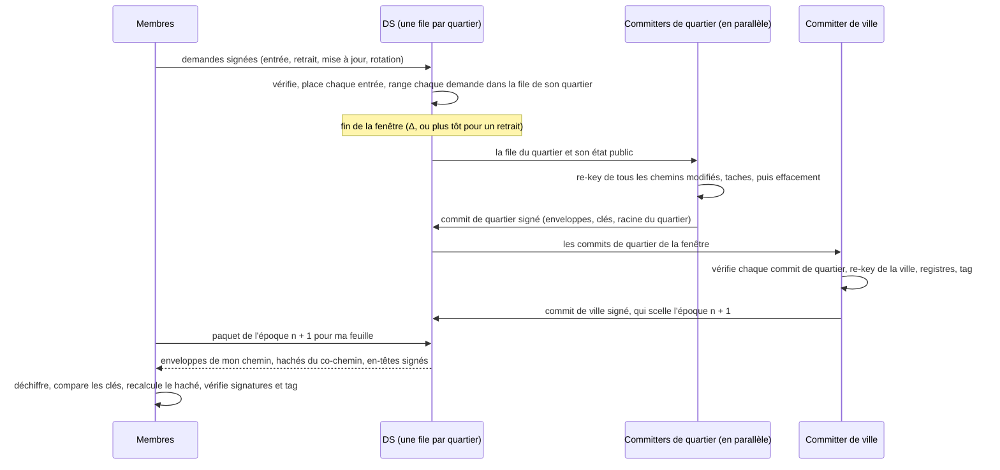

# Groupes de plusieurs millions de membres : état de l'art et architecture « Cité »

| | |
| --- | --- |
| Date | 2026-09-25 |
| Nature | Note de recherche. Rien de ce qui est proposé ici n'est implémenté ; le profil en vigueur reste [`city-g/v0.3`](../specs.md) ([note de conception](../design-v0.3.md)). |
| Question | Comment City-G peut-il servir des groupes de millions de membres, où des centaines de milliers de personnes entrent et sortent en même temps, sans que les demandes en attente au service de distribution (DS) deviennent un goulot d'étranglement ? |
| Compagnon | [`rekey_sim.py`](rekey_sim.py), modèle de coût du re-key par fenêtres et par quartiers. `python3 docs/research/rekey_sim.py` redonne tous les chiffres de la section 4 (graine fixe, une quinzaine de secondes). |
| Auteur | Claude Code (assistant IA d'Anthropic), à la demande du mainteneur. Les propositions n'ont encore ni modèle formel ni preuve (feuille de route, section 7) ; une relecture cryptographique humaine reste nécessaire avant toute décision. |

Vocabulaire. Une *enveloppe* est le secret d'un nœud de l'arbre chiffré vers
la clé publique d'un enfant : un chiffré X-Wing (1120 octets) et le secret
scellé (48 octets). Δ est la durée d'une fenêtre. N est la taille du groupe,
D le nombre de changements (entrées, retraits, mises à jour de clé) d'une
fenêtre.

## 0. Résumé

1. **La v0.3 ne peut pas atteindre l'échelle visée**, pour quatre raisons :
   - sa capacité est plafonnée à 8192 membres ;
   - ses commits sont séquentiels et font entrer au plus 64 membres et en retirer au plus 256 chacun ;
   - chaque membre traite chaque commit ;
   - l'arbre complet d'un million de membres pèserait environ 4,5 Go.

   Une vague de 100 000 entrées et 100 000 départs demanderait 1 563 commits successifs, soit 26 minutes à un commit par seconde. Pendant ce temps, les derniers membres retirés gardent l'accès.
2. **Le travail d'une vague a un coût minimal qu'aucun protocole ne peut éviter.** Remplacer D membres parmi N coûte au moins de l'ordre de D·ln(N/D) chiffrés, et cette borne est atteinte. Pour 200 000 changements dans un groupe d'un million, cela fait de l'ordre de 331 000 chiffrés, soit 387 Mo avec X-Wing. Des mises à jour concurrentes et indépendantes coûtent plus encore. Le coût total est donc fixé. Ce qu'on peut choisir :
   - le payer une seule fois par fenêtre ;
   - le répartir entre de nombreux appareils ;
   - garder ce que chaque membre télécharge en O(log N).
3. **Proposition « Cité » :**
   - **Arbre :** un seul arbre de clés, découpé en *quartiers* de 4096 feuilles et surmonté d'une *ville* ; les époques avancent par fenêtres de temps.
   - **Commits :** à la fin d'une fenêtre, un committer par quartier re-keye en parallèle tous les chemins modifiés de son quartier, puis un committer de ville re-keye les niveaux supérieurs. Ces rôles ne demandent aucun secret de l'époque précédente, donc n'importe quel membre peut les prendre.
   - **DS :** il tient une file par quartier, vidée entièrement à chaque fenêtre, et livre à chaque membre uniquement son chemin, comme dans SAIK.
   - **Taches :** chaque nœud garde le nom du committer qui l'a « taché » (Tainted TreeKEM). Retirer un membre re-keye aussi les nœuds qu'il tache encore.
   - **Simplifications :** plus de welcome ; le registre passe en cartes de Merkle creuses ; des points de contrôle signés par les admins ancrent les entrées.
4. **Chiffres (simulateur, suite actuelle X-Wing et ML-DSA-65) :**
   - Pour un million de membres et 200 000 changements dans une seule fenêtre : 6,0 Mo pour le commit du quartier le plus chargé et 0,76 Mo pour celui de la ville ; chaque membre télécharge environ 19 Ko, en-têtes compris ; le total reste à moins d'un facteur 2 de la borne inférieure.
   - Pour 8,4 millions de membres et un million de changements : un facteur 1,8 de la borne et environ 21 Ko par membre.
5. **Prix à payer :**
   - un retrait prend effet à la fin de sa fenêtre, soit au plus 2Δ ;
   - les committers voient plus de secrets, d'où le suivi des taches et l'effacement obligatoire ;
   - l'appartenance est vérifiée quartier par quartier ;
   - sans chaîne d'init, la confidentialité persistante repose sur la mise à jour quotidienne des feuilles. C'est ce que la v0.3 annonce déjà, mais moins que ce que sa chaîne d'init donne en pratique (section 3.3) ;
   - le trafic de fond va de 2 à 21 Mo par jour pour un membre qui suit tout, selon que la fenêtre dure 10 minutes ou 1 minute. Il vient surtout des mises à jour quotidiennes des feuilles et des signatures.
6. **Suite :** un brouillon de spécification, un modèle ProVerif des taches, un prototype du re-key multi-chemins, un DS à files par quartier testé en charge, et l'évaluation d'un KEM multi-destinataires.

## 1. Où bloque la v0.3

La v0.3 regroupe déjà les entrées : les demandes attendent au DS et le
prochain commit les place ensemble. Mais tout passe par une seule chaîne de
commits, que chaque membre rejoue.

| Limite | Spécification | Effet à l'échelle visée |
| --- | --- | --- |
| Capacité fixée à la genèse, au plus `MAX_CAPACITY` = 8192 feuilles | 6.1, 16 | Impossible au-delà de 8192 membres. La borne servait à garder une mise à jour sous 10 Mo. |
| Une seule chaîne d'époques : le premier commit valide de l'époque n + 1 gagne, les autres sont refusés et reconstruits | 12.1 | Un seul commit à la fois pour tout le groupe. |
| Au plus 64 entrées et 256 retraits par commit, les plus anciens d'abord | 12.1, 16 | 100 000 entrées et 100 000 retraits demandent 1 563 commits successifs. La file du DS se vide à ce rythme, et un retrait attend tous ceux qui le précèdent. |
| Chaque membre traite chaque commit, dans l'ordre | 13.2, 14.2 | Chaque membre, même léger, télécharge et vérifie 1 563 commits. |
| Arbre complet d'environ 35 Mo pour 8192 membres | 19 | Environ 4,5 Go pour un million. Il faudrait des membres légers partout, et l'auteur d'un commit doit tenir l'arbre complet. |
| Un welcome par entrée, scellé par l'auteur du commit | 10.3 | Tout le travail des entrées d'une époque retombe sur un seul appareil. |
| Registre en listes bornées : 4096 admissions retirées, puis un plancher | 7 | Avec 100 000 retraits par vague, le plancher monte à chaque vague et refuse des admissions encore valides. |
| Feuilles non fusionnées et chemins effacés | 6.4, 19 | Les commits suivants grossissent tant que les membres ne se remettent pas à jour ; l'effet est mesuré pour MLS (section 2.3). |

## 2. Ce que dit la recherche

### 2.1 Bornes inférieures : ce qu'aucun protocole ne peut faire

* **Un changement coûte au moins log2 n chiffrés.** C'est une borne amortie
  par changement de membre (Micciancio et Panjwani, Eurocrypt 2004). Elle
  vaut pour la distribution de clés multicast construite avec du chiffrement
  symétrique, des générateurs pseudo-aléatoires et du partage de secret, et
  elle est atteinte.
* **Remplacer d membres parmi n coûte Ω(d·ln(n/d)) chiffrés.** Cette borne
  est asymptotiquement atteinte, s'applique au multicast comme aux CGKA et
  généralise la précédente (Anastos et al., 2024). Pour 200 000 changements
  dans un groupe de 2^20 membres, elle donne de l'ordre de 331 000 chiffrés
  (avec une constante de 1), soit 387 Mo avec X-Wing, quel que soit le
  protocole.
* **Des mises à jour concurrentes coûtent plus cher.**
  - Si un nombre linéaire de membres se mettent à jour en même temps et veulent guérir vite, la communication devient linéaire en n (Bienstock, Dodis et Rösler, TCC 2020).
  - Guérir en k mises à jour par membre coûte au moins de l'ordre de k·n^(1+1/(k−1))/log k, soit n² pour k = 2 (Auerbach, Cueto Noval, Pascual-Perez et Pietrzak, TCC 2023).
* **Le pire cas est linéaire.**
  - C'est vrai pour toute CGKA construite en boîte noire à partir d'un chiffrement à clé publique (Bienstock et al., TCC 2022).
  - Bartusek, Bitansky, Dodis, Garg et Wu (CRYPTO 2026) obtiennent un pire cas logarithmique sous une hypothèse de réseaux euclidiens (decomposed LWE). Mais leur construction perd la confidentialité persistante, et la variante qui la retrouve rafraîchit en temps linéaire. C'est un résultat théorique, pas une piste d'implémentation.

**Conséquence pour City-G :**
- Le coût total d'une vague est fixé par ces bornes.
- On peut ne le payer qu'une fois par vague, en regroupant les changements.
- On évite les mises à jour concurrentes d'un même nœud en coordonnant les changements plutôt qu'en les fusionnant.
- On peut répartir ce coût entre beaucoup d'appareils.
- On peut garder ce que télécharge chaque membre en O(log N).

### 2.2 La gestion de clés multicast connaît déjà le re-key par lots

* **LKH** (Wong, Gouda et Lam, SIGCOMM 1998) : un arbre de clés. Chaque
  changement renouvelle le chemin de la feuille à la racine, en O(log n)
  messages.
* **Le re-key par lots** (Li, Yang, Gouda et Lam, WWW 2001) :
  - le serveur de clés accumule les entrées et les sorties pendant un intervalle ;
  - il renouvelle ensuite une seule fois l'union des chemins touchés ;
  - c'est bien moins cher que des re-keys individuels, et les clés restent synchronisées avec les données.
* **Iolus** (Mittra, SIGCOMM 1997) : des sous-groupes indépendants, reliés
  par des agents qui rechiffrent le trafic de l'un vers l'autre. Le schéma
  passe très bien à l'échelle, mais les agents voient les messages en clair :
  ce n'est pas du bout en bout.

LKH et le re-key par lots supposent un serveur de clés qui connaît toutes
les clés. TreeKEM, dans MLS comme dans City-G, place des clés publiques aux
nœuds : n'importe quel membre peut re-keyer sans connaître les secrets des
autres. « Cité » reprend le re-key par lots de LKH dans ce cadre.

### 2.3 CGKA et concurrence

| Travail | Idée | Ce qu'on en retient |
| --- | --- | --- |
| MLS, propose-and-commit (RFC 9420) | Des propositions concurrentes, puis un commit qui les applique. | Les nœuds effacés et les feuilles non fusionnées renchérissent les commits. Avec des auteurs tirés au hasard, une seule proposition de mise à jour par commit suffit pour que le coût attendu dépasse √N. Il tend vers N quand les propositions dominent (Auerbach, Cueto Noval, Erol et Pietrzak, 2025). |
| MLS-Cutoff (même article) | Chaque proposition re-keye son propre chemin jusqu'à un point de coupure ; un nœud touché par deux propositions est effacé. | Le coût reste en Θ(log N) avec quelques propositions aléatoires par commit, avec la même sécurité que MLS. Mais il n'y a toujours qu'un commit à la fois. |
| CoCoA (Eurocrypt 2022), DeCAF (2022) | Les mises à jour concurrentes sont fusionnées par rondes. | On chiffre vers des clés en train d'être remplacées : la guérison prend plusieurs rondes (jusqu'à la profondeur de l'arbre pour CoCoA), et CoCoA n'atteint que la sécurité semi-active. |
| FREEK et DMLS (CRYPTO 2023, draft IETF) | Les init secrets sont gardés derrière un PPRF pour traiter des commits hors ordre. | Les forks sont tranchés (le plus grand confirmation tag gagne), pas fusionnés : l'historique reste une chaîne. |
| DCGKA (CCS 2021), BeeKEM (2026) | Pas d'ordre central : ordre causal, ou « clés en conflit » gardées dans l'arbre. | O(n) par opération pour DCGKA ; pire cas linéaire pour BeeKEM. Adapté au pair-à-pair. |
| Tainted TreeKEM (S&P 2021) | Un membre peut re-keyer des nœuds hors de son chemin ; ces nœuds sont *tachés* par lui, et le protocole garde la trace des taches. | Retirer ce membre, ou le guérir, re-keye aussi les nœuds qu'il tache encore. La construction a des preuves contre un adversaire adaptatif. C'est la brique qui permet à un committer de re-keyer pour d'autres. |
| Quarantined-TreeKEM (CCS 2024) | Les clés des membres inactifs sont renouvelées à leur place et protégées par partage de secret. | Une piste pour les membres absents longtemps, nombreux dans un très grand groupe. |

City-G a déjà un DS qui ordonne. Mieux vaut s'en servir pour coordonner et
regrouper les changements, sans lui confier aucun secret, que chercher à
fusionner des mises à jour concurrentes, ce qui coûte plus d'après la
section 2.1. D'où un seul re-key logique par fenêtre, calculé à plusieurs sur
des sous-arbres disjoints.

### 2.4 L'aide du serveur et la bande passante

* **SAIK** (Alwen, Hartmann, Kiltz et Mularczyk, CCS 2022) :
  - l'auteur d'un commit ne signe plus tout le paquet, seulement le confirmation tag, qui lie les secrets et l'état de la nouvelle époque ;
  - le serveur peut donc découper le commit et n'envoyer à chaque membre que sa part ;
  - le chiffrement devient multi-messages et multi-destinataires ;
  - dans un groupe nouvellement créé de 10 000 membres, un changement d'état coûte au plus 2,7 Ko de téléchargement par membre, contre 1,38 Mo avec le TreeKEM de MLS.
* **Chained CmPKE** (Hashimoto, Katsumata, Postlethwaite, Prest et
  Westerbaan, CCS 2021) :
  - des KEM multi-destinataires (mKEM) post-quantiques dont les clés partagent un paramètre public (la matrice) ;
  - la partie commune du chiffré est envoyée une fois ; celle de chaque destinataire tient en 24 à 128 octets selon le schéma (au niveau 1 du NIST), au lieu d'un chiffré complet par destinataire ;
  - la croissance du coût d'envoi d'un commit baisse de deux à trois ordres de grandeur par rapport aux instanciations naïves.
* **FN-DSA** (FIPS 206, pas encore publiée en version finale) : une
  signature fait 666 octets en FN-DSA-512 et 1280 en FN-DSA-1024, contre
  3309 en ML-DSA-65.

### 2.5 La pratique aujourd'hui

Dans les grandes messageries, les groupes chiffrés de bout en bout s'arrêtent
vers mille membres : 1000 chez Signal, 1024 chez WhatsApp. Les chaînes
WhatsApp, sans limite de taille, ne sont pas chiffrées de bout en bout. Nous
n'avons trouvé aucune messagerie déployée qui offre un groupe chiffré de bout
en bout d'un million de membres, avec sécurité après compromission et après
retrait. « Cité » vise donc une case vide : c'est de la recherche appliquée,
pas un portage.

## 3. L'architecture « Cité »

### 3.1 Vue d'ensemble

Le groupe est un seul arbre binaire de clés, comme en v0.3, dont la largeur
double quand il le faut. Les l = 12 premiers niveaux forment des *quartiers* :
des sous-arbres de 4096 feuilles. Les niveaux au-dessus forment la *ville*.

```
                          racine
                    /                \                 ville : niveaux l+1 à H,
               ...                      ...            un committer de ville
        /             \           /            \
  quartier 0     quartier 1 ... quartier K-2   quartier K-1
  (4096 feuilles)                                      quartiers : niveaux 1 à l,
                                                       un committer par quartier
```

Chaque nœud porte trois informations :
- sa clé publique ;
- son haché ;
- sa *tache* : l'occupation `[leaf, since]` du committer qui a produit son secret actuel.

Chaque feuille est un membre, décrit comme en v0.3. Un groupe d'au plus 4096
membres n'a qu'un quartier : son committer fait aussi office de committer de
ville, et le groupe se comporte presque comme en v0.3. La taille des
quartiers borne le coût d'un commit (au plus environ 12 Mo, quand tout le
quartier change), comme la capacité de 8192 le faisait en v0.3, mais sans
borner la taille du groupe.

Une fenêtre se déroule ainsi :



### 3.2 Des époques par fenêtres

* **Ouverture et fermeture :**
  - une fenêtre s'ouvre au premier changement enregistré ;
  - elle se ferme au plus tard Δ_max après, un paramètre du groupe qui borne le délai de retrait ;
  - elle se ferme plus tôt, au bout de Δ_min, si un retrait attend et que le groupe exige des retraits rapides ;
  - une fenêtre vide ne crée pas d'époque.
* **Scellement :** l'époque n + 1 est scellée par le commit de ville, qui couvre tous les commits de quartier de la fenêtre.
* **Pas de plafond par commit :** un commit de quartier vide toute sa file, soit au plus ses 4096 feuilles.
* **Délai de retrait :** un retrait enregistré pendant une fenêtre prend effet à l'époque suivante, donc après au plus Δ plus le temps des commits. Si les commits prennent moins de Δ, c'est au plus 2Δ, quelle que soit la taille de la vague.

### 3.3 Re-key multi-chemins en chaîne

Quels nœuds changent, et comment :
* **Nœuds renouvelés.** Chaque ancêtre d'une feuille modifiée (entrée, retrait, mise à jour, rotation) reçoit un nouveau secret dans la fenêtre. Aucun autre nœud ne change.
* **Chaînage.** Un nœud renouvelé tire son secret de celui d'un de ses enfants renouvelés, par dérivation à sens unique, comme les path secrets de TreeKEM. Ce secret est enveloppé vers l'autre enfant, avec la nouvelle clé de celui-ci s'il est aussi renouvelé.
* **Deux niveaux sans chaînage.** Juste au-dessus des feuilles, les secrets sont ceux des membres. Juste au-dessus des racines de quartier, pour le committer de ville, ce sont ceux des committers de quartier. À ces deux niveaux, le committer ne connaît le nouveau secret d'aucun enfant : il tire un secret frais et l'enveloppe vers les deux enfants.
* **Retraits et entrées.** Une feuille retirée devient vide et ne reçoit rien. Une feuille qui entre reçoit tout son chemin dans la fenêtre : il n'y a ni feuille non fusionnée, ni chemin effacé, ni welcome.
* **Vérification.** Comme en v0.3 (section 6.5), la clé publique d'un nœud dérive de son secret, et chaque membre vérifie que les clés qu'il dérive sont celles publiées.

Le secret d'époque et ses conséquences :
* **Pas de chaîne d'init.** `epoch_secret(n+1) = KDF(secret de la racine, GroupContext(n+1))`, où le GroupContext lie le haché d'arbre, les racines des registres et le transcript. Rien de l'époque précédente n'est nécessaire pour entrer dans la suivante. Cela a trois effets :
  - les entrants n'ont pas besoin de welcome ;
  - les committers n'ont pas besoin d'état secret ;
  - un membre rattrape son retard en O(log N) (section 3.7).
* **Ce qu'on perd.** Avec la chaîne d'init de la v0.3, un adversaire qui vole plus tard une clé de feuille peut retrouver les commit secrets passés à partir du trafic enregistré, mais pas les secrets d'époque, qui dépendent aussi des init secrets effacés. Sans cette chaîne, la fuite d'une clé de feuille expose les époques écoulées depuis la dernière mise à jour de cette feuille.
  - C'est exactement la garantie que la v0.3 annonce : confidentialité persistante hors d'une fenêtre `FS_WINDOW` de 24 heures (sections 2.2 et 13.4).
  - C'est en revanche moins que ce que sa chaîne d'init donne en pratique, et la mise à jour quotidienne des feuilles devient la vraie limite.
* **La variante qui garde la chaîne d'init.** Des welcomes seraient scellés par quartier, en parallèle, après le commit de ville, à raison d'une enveloppe par entrant. Mais un membre absent devrait rejouer la chaîne d'init époque par époque, et son rattrapage coûterait autant que de suivre chaque fenêtre. Le choix revient à l'étape R1.
* **Aléa renforcé.** En MLS, la chaîne d'init protège aussi contre un mauvais aléa du committer. Pour garder cette défense, un committer tire ses secrets frais comme `KDF(son aléa, secret de l'époque précédente, nœud)`. Cela protège contre un adversaire extérieur, comme le faisait la chaîne d'init.
* **Clé d'entrée à usage unique.** Une demande d'entrée porte une clé qui ne sert qu'une fois : dans la fenêtre d'entrée, l'enveloppe juste au-dessus de l'entrant lui est adressée. Comme en v0.3, une fuite ultérieure de la clé de feuille n'expose pas l'époque d'entrée.

C'est le re-key par lots de LKH, avec le chaînage de TreeKEM. Son coût reste
à un facteur 1,5 à 2,7 de la borne inférieure (section 4).

### 3.4 Des committers sans état

* **Committer de quartier.**
  - Ce qu'il lui faut : l'état public de son quartier (clés, feuilles, hachés et taches, environ 18 Mo avec la suite actuelle) et sa file.
  - Ce qu'il produit : le commit de quartier, signé par sa clé d'appareil. Il contient les changements appliqués, les enveloppes, les nouvelles clés publiques et taches, la nouvelle racine (clé et haché) et les insertions et suppressions dans les cartes globales (section 3.8).
* **Committer de ville.**
  - Il vérifie d'abord chaque commit de quartier : signatures, admissions, structure, taches.
  - Il re-keye ensuite les niveaux de la ville, fusionne les cartes globales et calcule le haché d'arbre, le transcript et le confirmation tag.
  - Enfin, il signe le commit de ville.
* **Aucun rôle n'a besoin d'un secret de l'époque précédente**, sauf le mélange facultatif de l'aléa. N'importe quel membre peut donc prendre n'importe quel rôle.
  - Le DS attribue les rôles de chaque fenêtre parmi des membres volontaires et bien connectés, en préférant les plus stables.
  - Il remplace un committer qui ne livre pas avant l'échéance.
  - La règle C-03 de la v0.3 reste : un committer ne figure jamais parmi les membres qu'il retire, et un membre dont le retrait est demandé ne reçoit pas de rôle.
* **Retrait jamais reporté.** Si un quartier a un retrait en attente et qu'aucun committer ne livre, le committer de ville re-keye lui-même ce quartier. C'est le même travail, sur un état public. Un retrait n'est donc jamais reporté de plus d'une fenêtre.

### 3.5 Taches et effacement

Un committer connaît les secrets des nœuds qu'il re-keye pour les autres.
S'il est malveillant et les garde, il peut lire les époques suivantes même
après son retrait. C'est l'attaque que Tainted TreeKEM traite, avec les
règles suivantes :

* **Tache publique.** Chaque nœud porte la tache de son secret actuel. Elle est publique et hachée avec l'arbre, donc tous les membres s'accordent dessus.
* **Retrait.** Retirer un membre re-keye son chemin et tous les nœuds qu'il tache encore.
* **Mise à jour.** La mise à jour d'un membre re-keye son chemin et ses taches : sa guérison après compromission couvre aussi ce qu'il a vu comme committer.
* **Effacement.** Un committer honnête efface les secrets produits hors de son propre chemin dès que son commit est envoyé. Une compromission ultérieure de l'appareil ne révèle alors que son chemin, comme pour tout membre.

Le coût reste borné par un quartier (au plus 2 × 4096 enveloppes) ou par la
ville :
- Dans la simulation, retirer le committer du quartier le plus chargé juste après une fenêtre de 200 000 changements coûte 2 693 enveloppes (6,0 Mo), soit un commit de quartier de plus.
- Pire cas : si une vague retire des committers de tous les quartiers qui ont encore des taches, il faut re-keyer tout l'arbre, soit environ 2N enveloppes.

Deux choses réduisent ce risque :
- une tache disparaît dès que quelqu'un d'autre re-keye le nœud, ce qui arrive souvent dans les niveaux hauts ;
- on choisit comme committers des membres stables : admins, membres de longue date, appareils toujours en ligne.

### 3.6 Les files du DS

* **Une file par quartier.** Le DS peut se partager par quartier : un rédacteur par quartier et un pour la ville, au lieu d'un par groupe.
* **Placement :**
  - un service de placement attribue à chaque entrée une feuille libre, dans un quartier qui a de la place, en équilibrant la charge ;
  - un retrait, une mise à jour ou une rotation va dans la file du quartier du membre ;
  - le DS vérifie à la réception ce qu'il vérifie aujourd'hui : signatures, admissions, invitations, unicité des demandes en attente.
* **Vidage complet.** Toute la file part dans la prochaine fenêtre. Il n'y a plus de plafond par commit, de course entre entrants, de commit externe ni de 409 à reconstruire.
* **Débit.** Il est borné par le coût total du re-key (section 2.1), réparti entre les committers de quartier qui travaillent en parallèle. Le commit de ville ne dépend que du nombre de quartiers : au plus 3 071 enveloppes pour 2 048 quartiers.
* **Un DS malveillant** peut mal placer, ce qui coûte, ou retarder et refuser, ce qui nuit à la disponibilité, comme aujourd'hui. Il ne peut ni lire ni forger.

### 3.7 Livraison par membre et rattrapage

* **Paquet par membre.** Pour chaque époque, le DS assemble un paquet :
  - les enveloppes du chemin du membre ;
  - les hachés de son co-chemin, pour recalculer le haché d'arbre ;
  - l'en-tête signé du commit de ville, et celui de son commit de quartier si son quartier a changé.

  Comme dans SAIK, ces en-têtes lient tout le reste : le membre ne télécharge pas les commits entiers.
* **Rattrapage.** Quelle que soit la durée d'absence, la dernière enveloppe de chaque nœud du chemin suffit :
  - au plus H enveloppes (20 pour un million de membres, 23 pour 8 millions) ;
  - plus les en-têtes et la chaîne des hachés de transcript, à 32 octets par époque manquée.

  Cela tient parce qu'un nœud n'est jamais renouvelé sans que ses ancêtres le soient aussi.
* **Historique.** Un membre peut ouvrir n'importe quelle époque passée depuis sa dernière mise à jour, au même coût (une enveloppe par niveau), sans rejouer les époques intermédiaires.
  - Lire les messages de k époques coûte k paquets.
  - Contrepartie : pour un membre, la confidentialité persistante est bornée par ses mises à jour de feuille (section 3.3). Un membre qui se met à jour perd l'accès aux époques antérieures qu'il n'a pas gardées.
* **Entrants.** Ils reçoivent le même paquet que les autres membres : pas de welcome, et aucune dépendance aux committers une fois l'époque scellée.

### 3.8 Ensembles globaux, admins et ancrage des entrées

* **Le registre devient des cartes de Merkle creuses** : les admissions retirées (indexées par haché d'admission, qui expirent avec l'admission) et les identifiants d'appareil (unicité). Leurs racines vont dans le GroupContext.
  - Chaque commit de quartier liste ses insertions et suppressions ; le committer de ville les fusionne et publie les nouvelles racines.
  - Si un même appareil entre dans deux quartiers la même fenêtre, le commit de quartier le plus tardif est refusé. Seul un DS ou un committer fautif peut provoquer ce conflit.
  - Il n'y a plus de plafond ni de plancher.
* **Opérations globales.** Les admins, les changements d'admin, les invitations et leurs révocations passent par le commit de ville ; ces opérations sont rares.
* **Points de contrôle.** Un admin signe régulièrement un couple (époque, haché de transcript), et les invitations portent le plus récent.
  - L'entrant vérifie la chaîne des en-têtes de ville, du point de contrôle jusqu'à son époque d'entrée. Il contrôle les signatures de committers membres, avec leurs preuves de feuille.
  - Cela lève la limite « Entering a group » de la v0.3 (section 2.3 de la spécification ; les *anchored joins* avaient été laissés de côté en v0.3). Un DS ne peut plus fabriquer une époque pour un entrant sans la signature d'un membre.
  - Coût : environ 60 en-têtes à vérifier pour un point de contrôle horaire avec Δ = 60 s.

### 3.9 Ce que vérifie chaque membre

| Vérification | Qui | Coût |
| --- | --- | --- |
| Signatures du commit de ville et de son commit de quartier, chaîne du transcript | Chaque membre | Deux signatures par époque suivie |
| Son chemin : clés dérivées égales aux clés publiées, haché d'arbre recalculé avec le co-chemin, confirmation tag | Chaque membre | Au plus H enveloppes et H hachés |
| Tous les changements de son quartier : admissions, signatures, placements, taches, cartes | Les membres qui le veulent : candidats committers, « vérificateurs de quartier » | La file du quartier, au plus 4096 feuilles |
| Tous les commits de quartier | Le committer de ville, avant de signer, et tout auditeur | D signatures par fenêtre, parallélisable |
| Les entrées dans les autres quartiers | Aucun membre n'en a la charge systématique. Le DS et le committer de ville les vérifient. Une entrée invalide est signée par son committer : c'est une preuve transférable, qui déclenche son retrait et celui du committer. | Aucun pour les membres |

C'est le principal recul par rapport à la v0.3 :
- en v0.3, chaque membre complet vérifie chaque entrée, et les membres légers font confiance au DS pour le haché d'arbre (spécification, section 14.6) ;
- ici, la vérification des autres quartiers est déléguée au DS et au committer de ville ; elle est détectable après coup plutôt qu'empêchée par chacun.

### 3.10 Suite compacte (facultative)

* **Un mKEM de la forme ML-KEM-768, avec une matrice commune au groupe.**
  - Tailles : 128 octets par destinataire au lieu de 1120, et 992 octets partagés par commit ; les clés publiques font 1184 octets.
  - C'est un schéma hors norme. Avant tout usage, il faut son analyse propre (transformation IND-CCA, génération et renouvellement de la matrice, hybridation avec X25519) : étape R5.
* **FN-DSA-1024 (1280 octets) au lieu de ML-DSA-65 (3309 octets)**, une fois FIPS 206 finalisée. Les messages en profiteraient aussi : chacun porte aujourd'hui une signature de 3,3 Ko.

### 3.11 Pistes écartées

* **Des sous-groupes v0.3 indépendants (groupe de groupes).**
  - Un message doit alors être chiffré pour chaque sous-groupe, soit O(K) par message.
  - L'autre option est de le faire relayer par des agents qui le voient en clair (Iolus).
* **Fusionner des mises à jour concurrentes** (CoCoA, DCGKA, BeeKEM). C'est plus cher d'après les bornes de la section 2.1, et inutile quand un DS peut ordonner.
* **DMLS.** Il rend les forks sûrs à trancher, mais l'historique reste séquentiel.
* **Chiffrer à plat vers chaque membre du quartier** (à la Chained CmPKE).
  - Quand presque tout le quartier change, c'est moins cher que l'arbre, car il n'y a pas de nouvelles clés publiques à publier.
  - En charge normale, en revanche, cela coûte 4096 enveloppes par quartier touché au lieu de quelques dizaines.
  - Un committer pourrait réserver ce mode aux quartiers presque entièrement renouvelés : c'est une optimisation à évaluer à l'étape R3.

## 4. Chiffres

Le modèle de [`rekey_sim.py`](rekey_sim.py) suppose :
- des changements tirés au hasard, dont la moitié sont des retraits, dans un arbre plein ;
- des quartiers de 2^12 feuilles ;
- des commits qui comptent leurs enveloppes, les nouvelles clés publiques, un en-tête de 200 octets et la signature.

Ce qu'un membre télécharge comprend :
- les enveloppes de son chemin ;
- les hachés de son co-chemin ;
- les en-têtes signés.

C'est une moyenne sur 20 000 membres. Suite actuelle : X-Wing et ML-DSA-65.

**Un million de membres** (2^20, 256 quartiers) :

| Changements D | Quartiers touchés | Commit du quartier le plus chargé | Commit de ville | Tous les commits | Enveloppes / borne D·ln(N/D) | Par membre : enveloppes (moy. / max), octets | Retrait du committer le plus chargé | Commits successifs en v0.3 |
| ---: | ---: | --- | --- | ---: | ---: | --- | --- | ---: |
| 100 | 81 | 34 env., 83 Ko | 247 env., 510 Ko | 3,3 Mo | ×1,58 | 4,2 / 10, 10 Ko | 51 env., 119 Ko | 1 |
| 1 000 | 250 | 88 env., 208 Ko | 383 env., 761 Ko | 25 Mo | ×1,55 | 6,2 / 12, 15 Ko | 105 env., 244 Ko | 8 |
| 10 000 | 256 | 402 env., 922 Ko | 383 env., 761 Ko | 170 Mo | ×1,59 | 7,9 / 14, 17 Ko | 417 env., 953 Ko | 79 |
| 100 000 | 256 | 1 816 env., 4,1 Mo | 383 env., 761 Ko | 937 Mo | ×1,77 | 9,5 / 17, 19 Ko | 1 828 env., 4,1 Mo | 782 |
| 200 000 | 256 | 2 683 env., 6,0 Mo | 383 env., 761 Ko | 1,4 Go | ×1,96 | 10,0 / 18, 19 Ko | 2 693 env., 6,0 Mo | 1 563 |
| 500 000 | 256 | 4 070 env., 9,0 Mo | 383 env., 761 Ko | 2,3 Go | ×2,74 | 10,6 / 19, 20 Ko | 4 078 env., 9,0 Mo | 3 907 |

**Huit millions de membres** (2^23, 2 048 quartiers) :

| Changements D | Quartiers touchés | Commit du quartier le plus chargé | Commit de ville | Tous les commits | Enveloppes / borne | Par membre | Retrait du committer le plus chargé | Commits successifs en v0.3 |
| ---: | ---: | --- | --- | ---: | ---: | --- | --- | ---: |
| 10 000 | 2 040 | 124 env., 289 Ko | 3 071 env., 6,1 Mo | 242 Mo | ×1,55 | 7,9 / 15, 17 Ko | 142 env., 328 Ko | 79 |
| 100 000 | 2 048 | 501 env., 1,1 Mo | 3 071 env., 6,1 Mo | 1,6 Go | ×1,59 | 9,5 / 17, 19 Ko | 518 env., 1,2 Mo | 782 |
| 1 000 000 | 2 048 | 2 069 env., 4,6 Mo | 3 071 env., 6,1 Mo | 8,7 Go | ×1,81 | 11,1 / 20, 21 Ko | 2 082 env., 4,7 Mo | 7 813 |

Lecture :
* **Membres.** À N fixé, ce qu'un membre télécharge croît comme log D : 4 enveloppes pour 100 changements, 10 pour 200 000 (environ 19 Ko). Une vague de 200 000 changements entre en une époque au lieu de 1 563.
* **Coût total.** Il reste entre 1,5 et 2 fois la borne inférieure jusqu'à ce que 20 % du groupe change en une fenêtre. Quand la moitié du groupe change, le facteur monte à 2,7, mais il faut alors de toute façon re-keyer presque tout l'arbre.
* **Taille des commits.**
  - Un commit de quartier reste sous 9 Mo dans ces scénarios, et monte à environ 12 Mo au plus si tout un quartier change.
  - Celui de ville ne dépend que du nombre de quartiers : 0,76 Mo pour 256 quartiers, 6,1 Mo pour 2 048.
  - Au-delà de quelques dizaines de millions de membres, on ajouterait un niveau intermédiaire, des « arrondissements ».
* **Suite compacte.** Les commits font environ la moitié, car les nouvelles clés publiques y dominent. Un membre télécharge 4,6 à 7,6 Ko au lieu de 10 à 21 Ko.

**Régime permanent**, pour un membre qui suit chaque fenêtre (2^20 membres) :

| Changements par seconde | Fenêtre Δ | D par fenêtre | Délai de retrait | Enveloppes par membre et par fenêtre | Par jour, suite actuelle | Par jour, suite compacte |
| ---: | ---: | ---: | ---: | ---: | ---: | ---: |
| 0,1 | 10 s | 1 | ≤ 20 s | 1,0 | 46 Mo | 29 Mo |
| 0,1 | 60 s | 6 | ≤ 2 min | 1,7 | 9,0 Mo | 5,0 Mo |
| 0,1 | 10 min | 60 | ≤ 20 min | 3,8 | 1,3 Mo | 0,6 Mo |
| 1 | 10 s | 10 | ≤ 20 s | 2,3 | 60 Mo | 31 Mo |
| 1 | 60 s | 60 | ≤ 2 min | 3,8 | 13,5 Mo | 6,2 Mo |
| 1 | 10 min | 600 | ≤ 20 min | 5,8 | 2,0 Mo | 0,9 Mo |
| 12 | 10 s | 120 | ≤ 20 s | 4,4 | 92 Mo | 42 Mo |
| 12 | 60 s | 720 | ≤ 2 min | 5,9 | 21 Mo | 9,4 Mo |
| 12 | 10 min | 7 200 | ≤ 20 min | 7,6 | 2,4 Mo | 1,0 Mo |

Pour situer ces rythmes :
- 0,1 changement par seconde fait 8 640 par jour, soit 0,8 % d'un million de membres.
- 12 changements par seconde, c'est ce que coûte à elle seule la mise à jour quotidienne des feuilles d'un million de membres (`FS_WINDOW`, section 3.3). C'est donc le vrai régime permanent d'un tel groupe, avant même les entrées et les départs.

* **Le levier principal est la longueur de la fenêtre.** Avec Δ = 10 s, un membre qui suit tout reçoit 8 640 en-têtes signés par jour, soit environ 30 Mo, presque tout en signatures ML-DSA-65, quel que soit le rythme des changements.
* **Le régime des mises à jour quotidiennes.** Avec Δ = 60 s, un membre qui suit tout reçoit environ 21 Mo par jour avec la suite actuelle, 9,4 Mo avec la suite compacte. Avec Δ = 10 min, ce n'est plus que 2,4 Mo, mais un retrait peut alors attendre 20 minutes.
* **Côté DS.** Avec Δ = 60 s et 0,1 changement par seconde, un million de membres actifs représentent environ 9 To de trafic sortant par jour ; au rythme des mises à jour quotidiennes, environ 21 To.
* **Membres qui ne suivent pas tout.** Ils ne paient que les époques qu'ils ouvrent : environ 31 Ko par époque avec la suite actuelle, 9 Ko avec la suite compacte.
* **Les messages coûtent autant.** Chaque message porte une signature de 3,3 Ko que chaque lecteur télécharge. À un message par minute, cela fait 4,8 Mo par jour et par lecteur, du même ordre que la gestion des clés.

## 5. Garanties : ce qui change par rapport à la v0.3

| Propriété | v0.3 | « Cité » |
| --- | --- | --- |
| Taille du groupe | Au plus 8192 | Des millions (simulé jusqu'à 2^23) |
| Changements par époque | Au plus 64 entrées et 256 retraits | Toute la file de chaque quartier |
| Délai de retrait | Le prochain commit, mais derrière toute la file : 26 min pour une vague de 200 000 à un commit par seconde | La fin de la fenêtre, au plus 2Δ, quelle que soit la vague |
| Sécurité après compromission | Mise à jour du membre, puis commit par un membre honnête | Pareil ; la mise à jour re-keye aussi les nœuds que le membre tache |
| Confidentialité persistante | Annoncée hors d'une fenêtre `FS_WINDOW` (24 h) ; en pratique, la chaîne d'init protège aussi les époques passées d'une fuite de clé de feuille ; clé d'entrée à usage unique (welcome) | La même fenêtre `FS_WINDOW`, qui devient la vraie limite : une fuite de clé de feuille expose les époques depuis la dernière mise à jour de la feuille ; les committers effacent ; clé d'entrée à usage unique |
| Secrets qu'un appareil connaît | Son chemin | Son chemin ; un committer connaît en plus, jusqu'à effacement, les nœuds qu'il re-keye (tachés par lui) |
| Vérification des entrées | Chaque membre complet vérifie tout ; les membres légers font confiance au DS pour le haché d'arbre | Le DS et le committer de ville vérifient tout, les vérificateurs de quartier leur quartier ; chaque membre vérifie son chemin et les signatures ; une fraude est signée, donc prouvable |
| Entrée dans le groupe | L'entrant fait confiance au DS pour son époque d'entrée (section 2.3) | Ancrée sur un point de contrôle signé par un admin |
| État d'un membre | Arbre complet (35 Mo à 8192 membres) ou membre léger | Son chemin (O(log N)) et les en-têtes |
| Rattrapage après une absence | Rejouer chaque commit | Au plus H enveloppes pour l'époque courante ; un paquet par époque ouverte pour l'historique |
| Commits concurrents | Le premier gagne, les autres sont refaits | Aucun conflit : sous-arbres disjoints, un seul committer de ville |
| Welcomes | Un par entrée | Aucun (un par entrant, scellé par quartier, dans la variante qui garde la chaîne d'init) |
| Registre | Listes bornées et plancher | Cartes de Merkle creuses, sans plafond |
| Primitives | X-Wing, ML-DSA-65 | Les mêmes ; suite compacte en option |

## 6. Risques et questions ouvertes

1. **Aucune preuve pour l'instant.** Il faut modéliser la composition de trois choses (étape R2) et, idéalement, la prouver : des committers qui re-keyent pour d'autres, des taches, et l'absence de chaîne d'init. Tainted TreeKEM est la référence la plus proche.
2. **Disponibilité des committers.**
   - Il faut des volontaires bien connectés dans chaque quartier. Les rôles sans état permettent de remplacer tout de suite un committer défaillant, mais une fenêtre peut s'allonger.
   - Un committer malveillant qui accepte le rôle puis ne livre pas ralentit le groupe jusqu'à son remplacement.
3. **Vérification optimiste des autres quartiers.** Un committer malveillant allié au DS peut faire entrer un membre fantôme jusqu'à la détection. La preuve est transférable, mais l'exposition dure tant que personne n'audite.
4. **Trafic.**
   - Un membre qui suit tout reçoit de 2 à 21 Mo par jour, et le DS émet des To par jour pour un million de membres actifs avec des fenêtres courtes.
   - Les messages eux-mêmes coûtent autant ou plus. Il faudra des fenêtres adaptatives, des membres qui ne suivent pas tout, et FN-DSA dès que possible.
5. **mKEM hors norme.** La suite compacte suppose un schéma qui n'est ni standardisé ni analysé dans ce cadre.
6. **Confidentialité persistante.**
   - Sans chaîne d'init, elle tient seulement si chaque membre met sa feuille à jour au moins toutes les `FS_WINDOW` : chaque membre qui ne le fait pas prolonge l'exposition de ses époques passées.
   - Dans un groupe d'un million, cela fait environ 12 changements par seconde en permanence (section 4). Ce coût existe déjà en v0.3 (section 13.4), mais il devient important à cette échelle.
   - Pour les absents, il faut s'inspirer de Quarantined-TreeKEM ; sinon, adopter la variante avec chaîne d'init (section 3.3).
7. **Métadonnées.** Le DS voit la structure, les placements et le rythme des changements, comme aujourd'hui.
8. **Complexité.**
   - Il faut deux sortes de commits, des fenêtres, des taches, des cartes creuses et des points de contrôle : la spécification et l'implémentation grossissent.
   - Un groupe d'au plus 4096 membres reste un seul quartier, au comportement proche de la v0.3.
9. **Placement adverse.** Un DS qui concentre les entrées dans quelques quartiers grossit leurs commits (au plus environ 12 Mo chacun), sans rien apprendre.

## 7. Feuille de route

La v0.3 reste le profil en vigueur. « Cité » serait un nouveau profil, qui
ne serait adopté qu'après les étapes R1 et R2 ; on n'y migrerait pas les
groupes v0.3.

| Étape | Livrable | Critère de sortie |
| --- | --- | --- |
| R1 | Une note `docs/design-v0.4.md` et un brouillon de profil `city-g/v0.4-draft`, qui couvrent : fenêtres, commits de quartier et de ville, taches, paquets par membre, cartes creuses, points de contrôle et règles du DS | Relecture ; vecteurs d'un exemple à deux quartiers |
| R2 | Un modèle ProVerif de quatre scénarios : committer malveillant retiré, avec et sans la règle des taches ; entrée sans welcome ; sécurité après compromission par mise à jour ; entrée ancrée face à un DS qui forke | Verdicts attendus, y compris l'attaque du scénario de contrôle sans la règle des taches |
| R3 | Un prototype dans `cityg-core` : re-key multi-chemins d'un quartier, taches, vérification d'un paquet | Un quartier de 4096 feuilles dont la moitié change se re-keye en moins d'une seconde de CPU ; un paquet se vérifie en moins de 10 ms |
| R4 | Côté DS : files par quartier, placement, fenêtres, attribution et remplacement des committers, puis un test de charge | 2^20 membres simulés et 200 000 changements scellés en une fenêtre, en moins de 2Δ |
| R5 | Suite compacte : analyse et implémentation d'un mKEM de la forme ML-KEM-768 ; FN-DSA quand FIPS 206 paraît | Décision documentée |

## 8. Sources

Bornes inférieures :
* D. Micciancio, S. Panjwani, [Optimal Communication Complexity of Generic Multicast Key Distribution](https://www.iacr.org/archive/eurocrypt2004/30270154/final.pdf), Eurocrypt 2004.
* M. Anastos et al., [The Cost of Maintaining Keys in Dynamic Groups with Applications to Multicast Encryption and Group Messaging](https://eprint.iacr.org/2024/1097), 2024.
* A. Bienstock, Y. Dodis, P. Rösler, [On the Price of Concurrency in Group Ratcheting Protocols](https://eprint.iacr.org/2020/1171), TCC 2020.
* B. Auerbach, M. Cueto Noval, G. Pascual-Perez, K. Pietrzak, [On the Cost of Post-Compromise Security in Concurrent Continuous Group-Key Agreement](https://eprint.iacr.org/2023/1123), TCC 2023.
* A. Bienstock et al., [On the Worst-Case Inefficiency of CGKA](https://eprint.iacr.org/2022/1237), TCC 2022.
* J. Bartusek, N. Bitansky, Y. Dodis, R. Garg, D. J. Wu, [Fair-Weather No More: Guaranteed Efficiency in Secure Group Messaging](https://eprint.iacr.org/2026/1677), CRYPTO 2026.

Gestion de clés multicast :
* C. K. Wong, M. Gouda, S. S. Lam, [Secure group communications using key graphs](https://dl.acm.org/doi/10.1145/285243.285260), SIGCOMM 1998.
* X. S. Li, Y. R. Yang, M. G. Gouda, S. S. Lam, [Batch Rekeying for Secure Group Communications](https://archives.iw3c2.org/www10/cdrom/papers/pdf/p521.pdf), WWW 2001.
* S. Mittra, [Iolus: a framework for scalable secure multicasting](https://www.semanticscholar.org/paper/Iolus:-a-framework-for-scalable-secure-multicasting-Mittra/53fcb9276d05b1f676bbd116a44537960f0878a0), SIGCOMM 1997.

CGKA et concurrence :
* B. Auerbach, M. Cueto Noval, B. Erol, K. Pietrzak, [Continuous Group-Key Agreement: Concurrent Updates without Pruning](https://eprint.iacr.org/2025/1035), 2025 (MLS-Cutoff).
* J. Alwen et al., [CoCoA: Concurrent Continuous Group Key Agreement](https://eprint.iacr.org/2022/251), Eurocrypt 2022.
* J. Alwen et al., [DeCAF: Decentralizable Continuous Group Key Agreement with Fast Healing](https://eprint.iacr.org/2022/559), 2022.
* J. Alwen, M. Mularczyk, Y. Tselekounis, [Fork-Resilient Continuous Group Key Agreement](https://eprint.iacr.org/2023/394), CRYPTO 2023 ; [draft-kohbrok-mls-dmls](https://datatracker.ietf.org/doc/draft-kohbrok-mls-dmls/).
* M. Weidner, M. Kleppmann, D. Hugenroth, A. R. Beresford, [Key Agreement for Decentralized Secure Group Messaging with Strong Security Guarantees](https://eprint.iacr.org/2020/1281), CCS 2021.
* Ink & Switch, [Group Key Agreement with BeeKEM](https://www.inkandswitch.com/keyhive/notebook/02/) ; [BeeKEM: Decentralized, Secure and Efficient Group Key Agreement](https://eprint.iacr.org/2026/1434.pdf), 2026.
* K. Klein, G. Pascual-Perez, M. Walter et al., [Keep the Dirt: Tainted TreeKEM, Adaptively and Actively Secure Continuous Group Key Agreement](https://eprint.iacr.org/2019/1489), IEEE S&P 2021.
* C. Chevalier, G. Lebrun, A. Martinelli, A. R. Taleb, [Quarantined-TreeKEM: a Continuous Group Key Agreement for MLS, Secure in Presence of Inactive Users](https://eprint.iacr.org/2023/1903), CCS 2024.

Aide du serveur et bande passante :
* J. Alwen, D. Hartmann, E. Kiltz, M. Mularczyk, [Server-Aided Continuous Group Key Agreement](https://eprint.iacr.org/2021/1456) (SAIK), CCS 2022.
* K. Hashimoto, S. Katsumata, E. Postlethwaite, T. Prest, B. Westerbaan, [A Concrete Treatment of Efficient Continuous Group Key Agreement via Multi-Recipient PKEs](https://eprint.iacr.org/2021/1407) (Chained CmPKE), CCS 2021.
* NIST, [FIPS 206 (FN-DSA) status update](https://csrc.nist.gov/csrc/media/presentations/2025/fips-206-fn-dsa-%28falcon%29/images-media/fips_206-perlner_2.1.pdf).

Pratique :
* Signal, [Group chats](https://support.signal.org/hc/en-us/articles/360007319331-Group-chats) (1000 membres).
* WhatsApp, [Communities Now Available](https://blog.whatsapp.com/communities-now-available) (groupes de 1024) ; [Introducing WhatsApp Channels](https://blog.whatsapp.com/introducing-whatsapp-channels-a-private-way-to-follow-what-matters) (chaînes non chiffrées de bout en bout par défaut).
