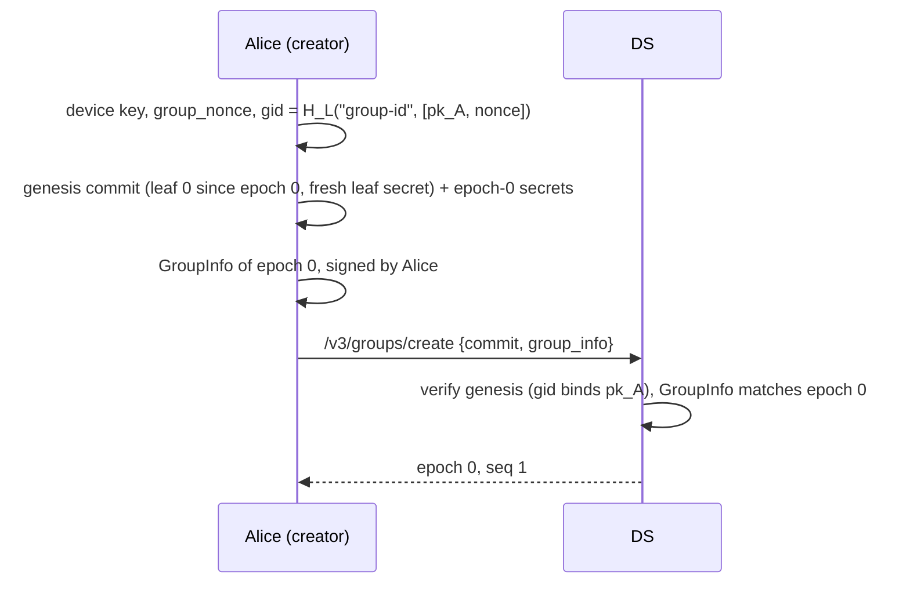
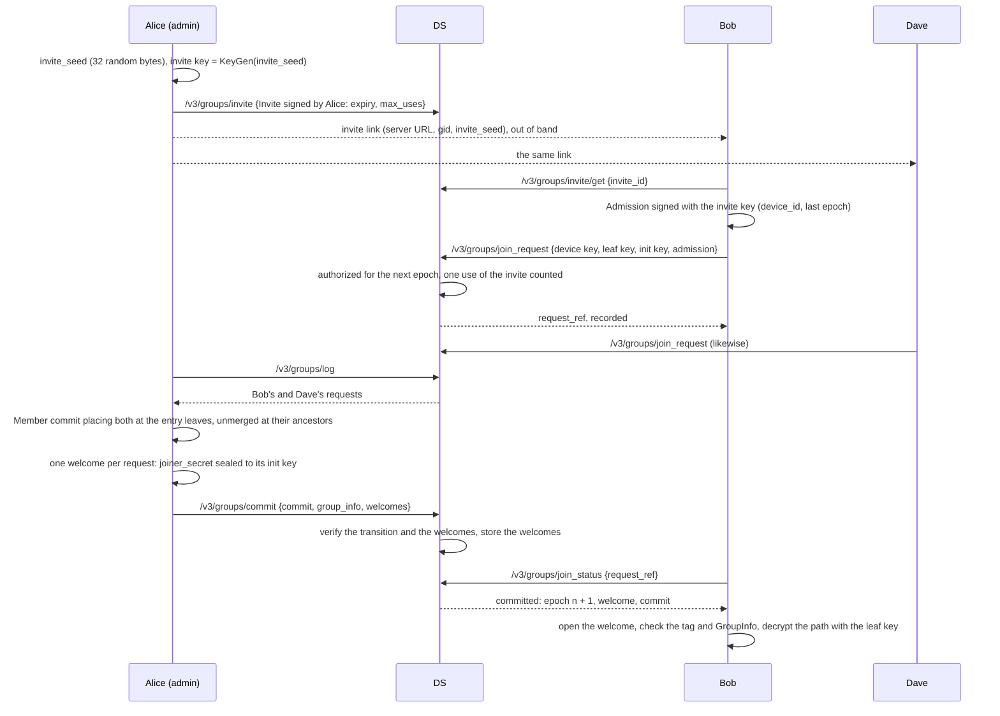
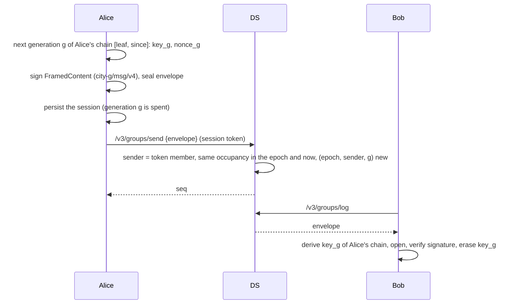
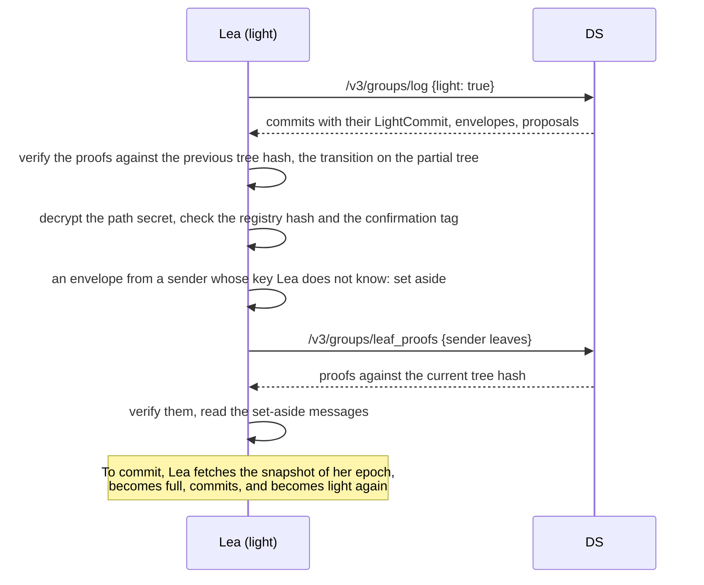

# Workflows

Sequence diagrams of the main operations of profile v0.3. "DS" is the
delivery service; section numbers refer to the [specification](specs.md).
Every commit below is verified by the DS against public state (tree,
registry, transcript) and by each member, which also derives the epoch
secrets and checks the confirmation tag (section 9.5).

## Creating a group



## Inviting and joining in batches

Joiners record requests; the next commit places all of them (section 13.1).



If no commit includes its request within 1 to 2 seconds, the joiner commits
its own entry instead:

```mermaid
sequenceDiagram
    participant B as Bob
    participant DS
    participant D as Dave
    B->>DS: /v3/groups/join_status
    DS-->>B: pending
    B->>DS: /v3/groups/info
    DS-->>B: GroupInfo, tree, registry, recorded removals and join requests
    B->>B: ExternalJoin: Bob at the entry leaf, then Dave's request; encapsulate to the external key
    B->>DS: /v3/groups/commit {commit, group_info, welcome for Dave}
    DS-->>B: epoch n + 1
    D->>DS: /v3/groups/join_status
    DS-->>D: committed: epoch n + 1, welcome, commit
```

A joiner that finds its request committed after the group moved on (it
cannot read that epoch any more) resyncs (section 13.1).

## Sending and receiving



## Leaving

A member never commits its own removal (section 9.4).

```mermaid
sequenceDiagram
    participant C as Carol (leaving)
    participant DS
    participant B as Bob
    C->>DS: /v3/groups/remove_proposal {RemoveProposal for [leaf, since], signed by Carol}
    DS->>DS: record it; refuse Carol's messages from now on
    DS-->>C: recorded
    B->>DS: /v3/groups/log (proposal entry) or /v3/groups/info
    B->>B: Member commit including the proposal: blank Carol's leaf and path, re-key Bob's path
    B->>DS: /v3/groups/commit
    C->>DS: /v3/groups/log
    DS-->>C: 403 (token of a removed member)
    C->>C: learn the removal, delete the group state
```

## Removing a member (admin)

```mermaid
sequenceDiagram
    participant A as Alice (admin)
    participant DS
    participant M as Mallory
    A->>A: RemoveProposal for Mallory's occupancy, signed by Alice
    A->>A: Member commit including it; Mallory's leaf and path blanked, her admission retired
    A->>DS: /v3/groups/commit
    DS->>DS: proposal authorized (Alice is an admin), transition verified
    Note over M: Mallory is not covered by the new path:<br/>she derives no secret of the new epoch,<br/>and cannot come back with her admission
```

## Concurrent commits


## Resyncing

A member that cannot process a commit (lost state, a path it cannot
decrypt) or that finds a commit it needs gone from the log re-enters its own
leaf as a new occupancy.

```mermaid
sequenceDiagram
    participant C as Carol
    participant DS
    C->>DS: /v3/groups/cover_failure {report: epoch, reason, signed}
    C->>DS: /v3/groups/info
    C->>C: Resync commit: same leaf, since = n, external init
    C->>DS: /v3/groups/commit
    DS->>DS: author is the member of that leaf; device key, admission and admin rights kept
```

## Rotating a device key

```mermaid
sequenceDiagram
    participant A as Alice
    participant DS
    participant B as Bob
    A->>A: new device key; Member commit with new_device_pk (key 17)
    A->>A: signature by the old key, rotation signature by the new key, GroupInfo signed with the new key
    A->>DS: /v3/groups/commit
    DS->>DS: the new key is no member's; the old session token stops working
    A->>DS: /v3/groups/session (SessionAuth signed with the new key)
    B->>DS: /v3/groups/log
    B->>B: Alice's leaf now holds the new key; her earlier messages still verify under the old one
```

## Following the group as a light member

A light member holds the occupancies, the registry and its own path, not the
tree (section 14).



A light joiner asks `/v3/groups/join_status` with `light` set and, while the
commit's epoch is current, enters with the LightJoin: the registry, the
occupancies and its own leaf proof.

## Periodic maintenance

Every member, on a timer (the GUI's default is 30 seconds):

1. commits the recorded removal proposals and join requests of other
   members, after a random delay to avoid concurrent commits;
2. re-keys its own leaf if its last update is older than `FS_WINDOW`
   (24 hours), for forward secrecy and post-compromise security;
3. erases the message keys of previous epochs once their 10-minute grace
   window has passed.
