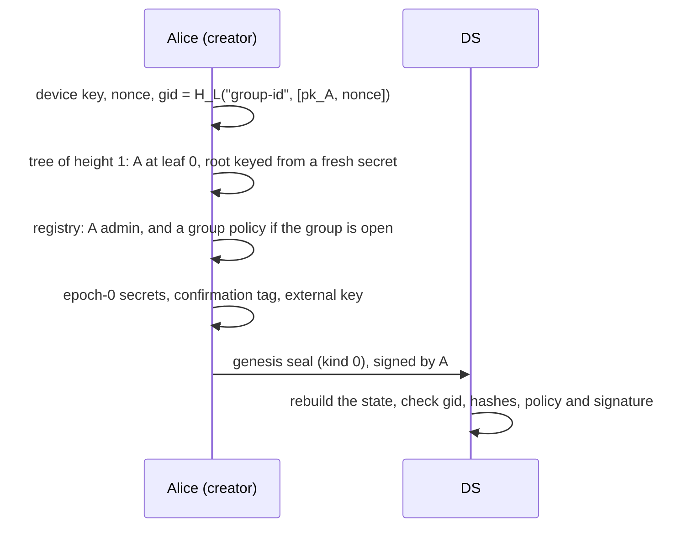
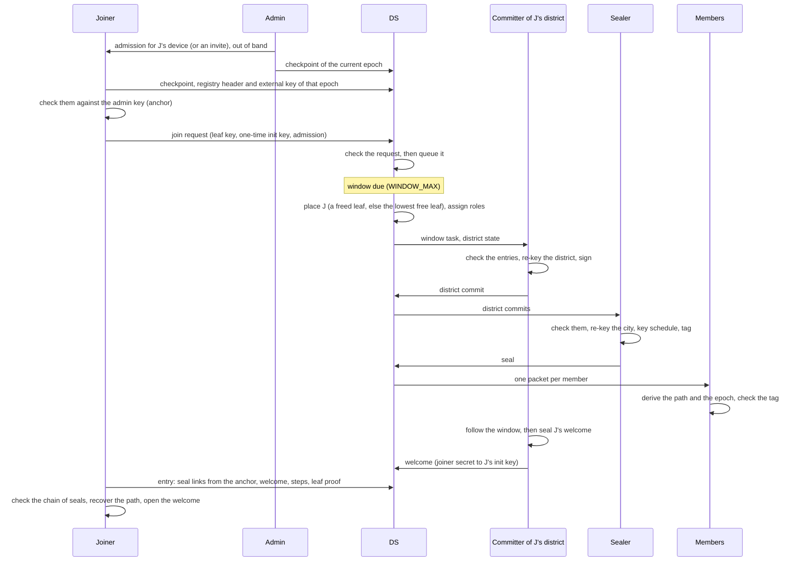
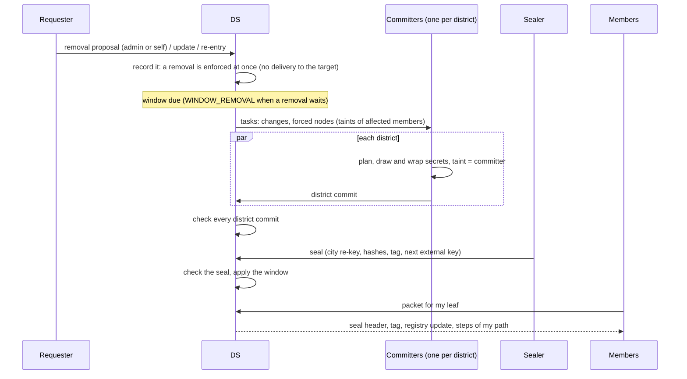
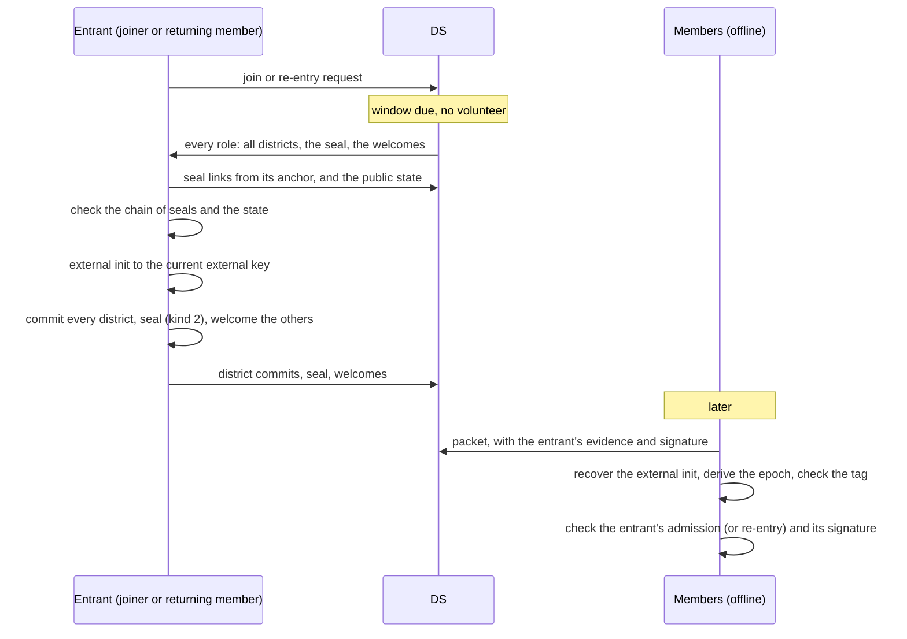
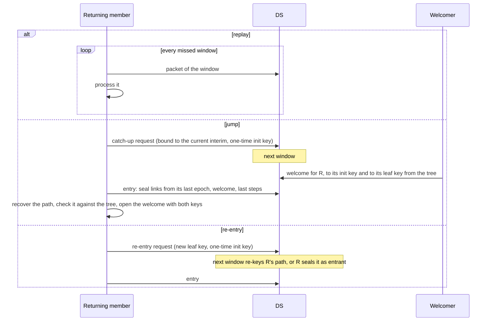
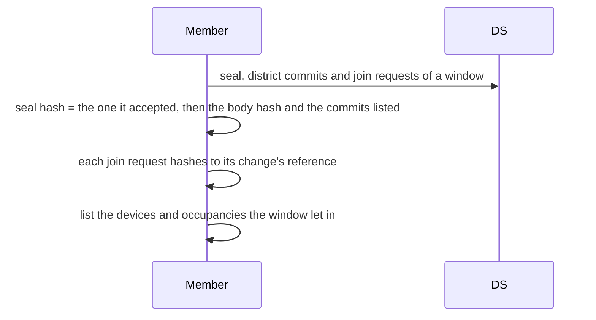

# Workflows

Sequence diagrams of the main operations. "DS" is the delivery service;
section numbers refer to the [specification](specs.md). The DS checks
everything it records or receives against the public state, and never
holds a group secret.

## Creating a group

The genesis seal is section 9 ("Genesis").

## Joining a closed group

Sections 11, 12.9 and 14.

## A window of changes

Removals, evictions, key updates and re-entries go through the same window
as joins.

Sections 10, 12.2 to 12.6 and 14.

## Nobody online

With no volunteer, the first joiner or re-entering member of the window
seals it alone.

With no volunteer and no entrant, the window stays open: recorded removals
are enforced by the DS at delivery until a participant comes (sections 12.7,
12.8 and 14.6).

## Coming back

Section 12.10.

## Seeing who joined an open group

A device of the DS that joined is listed like any other, and cannot pose as
an existing member: its requests would not verify under that member's
device key (sections 6.1 and 12.11).
