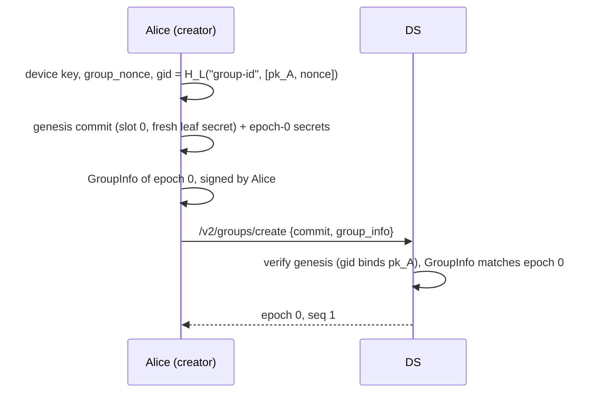
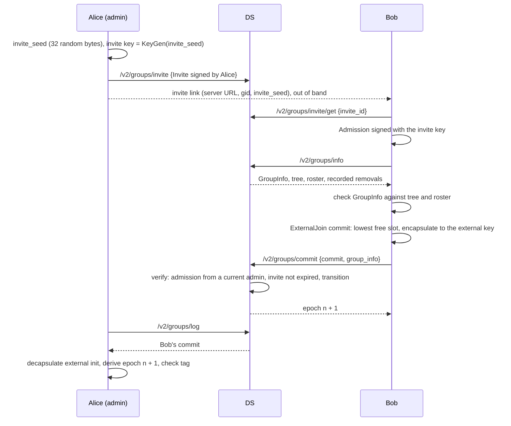
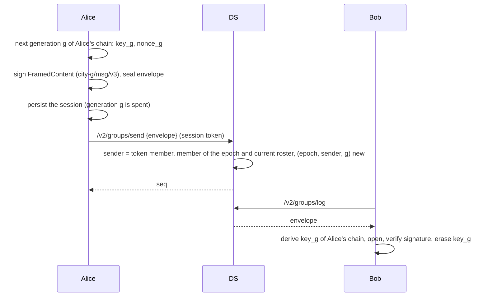
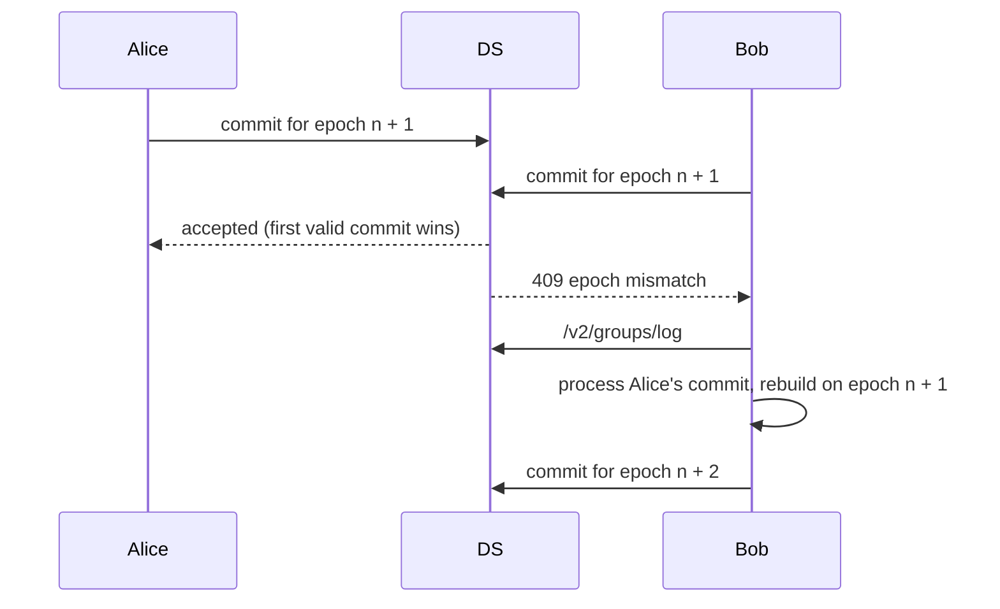

# Workflows

Sequence diagrams of the main operations of profile v0.2. "DS" is the
delivery service; section numbers refer to the [specification](specs.md).
Every commit below is verified by the DS against public state (tree, roster,
transcript) and by each member, which also derives the epoch secrets and
checks the confirmation tag (section 9.5).

## Creating a group



## Inviting and joining

The joiner needs no online member: it joins with an external commit.



## Sending and receiving



## Leaving

A member never commits its own removal (section 9.4).

```mermaid
sequenceDiagram
    participant C as Carol (leaving)
    participant DS
    participant B as Bob
    C->>DS: /v2/groups/remove_proposal {RemoveProposal signed by Carol}
    DS->>DS: record it; refuse Carol's messages from now on
    DS-->>C: recorded
    B->>DS: /v2/groups/log (proposal entry) or /v2/groups/info
    B->>B: Member commit including the proposal: blank Carol's leaf and path, re-key Bob's path
    B->>DS: /v2/groups/commit
    C->>DS: /v2/groups/log
    DS-->>C: 403 (token of a removed member)
    C->>C: learn the removal from the roster, delete the group state
```

## Removing a member (admin)

```mermaid
sequenceDiagram
    participant A as Alice (admin)
    participant DS
    participant M as Mallory
    A->>A: RemoveProposal for Mallory's occupancy, signed by Alice
    A->>A: Member commit including it; Mallory's leaf and path blanked
    A->>DS: /v2/groups/commit
    DS->>DS: proposal authorized (Alice is an admin), transition verified
    Note over M: Mallory is not covered by the new path:<br/>she derives no secret of the new epoch
```

## Concurrent commits



## Resyncing

A member that cannot process a commit (lost state, a path it cannot
decrypt) or that finds a commit it needs gone from the log re-enters its own
slot.

```mermaid
sequenceDiagram
    participant C as Carol
    participant DS
    C->>DS: /v2/groups/cover_failure {report: epoch, reason, signed}
    C->>DS: /v2/groups/info
    C->>C: Resync commit: same slot, next generation, external init
    C->>DS: /v2/groups/commit
    DS->>DS: author is the member of that slot; identity, admission and admin rights kept
```

## Periodic maintenance

Every member, on a timer (the GUI's default is 30 seconds):

1. commits the recorded removal proposals of other members, after a random
   delay to avoid concurrent commits;
2. re-keys its own leaf if its last update is older than `FS_WINDOW`
   (24 hours), for forward secrecy and post-compromise security;
3. erases the previous epoch's message keys once the 10-minute grace window
   has passed.
