# City-G Workflows and Sequence Diagrams

This document provides visual representations of key City-G workflows using sequence diagrams.

---

## Table of Contents

1. [Room Bootstrap](#room-bootstrap)
2. [Join Flow](#join-flow)
3. [Merge Flow](#merge-flow)
4. [Message Send and Receive](#message-send-and-receive)
5. [Epoch Acceptance](#epoch-acceptance)
6. [Forward Secrecy Pivot Rotation](#forward-secrecy-pivot-rotation)
7. [WebSocket Real-Time Notifications](#websocket-real-time-notifications)
8. [Member Roster Query](#member-roster-query)
9. [Visual Guides](#visual-guides)
   - [Two Proof Systems](#two-proof-systems)
   - [What the Server Sees (and Doesn't)](#what-the-server-sees-and-doesnt)
   - [Policy vs Cryptography](#policy-vs-cryptography)

---

## Room Bootstrap

**First member creates a new room**

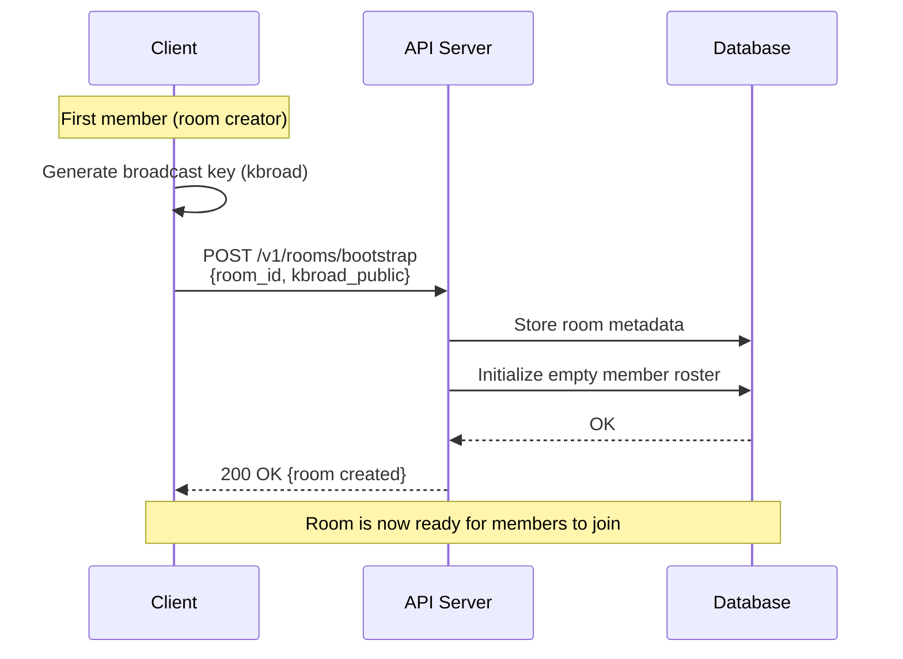

**Key Points:**
- Only the first member bootstraps the room
- Broadcast key must be shared securely with all members
- Room ID becomes the persistent identifier

---

## Join Flow

**New member joins an existing room**

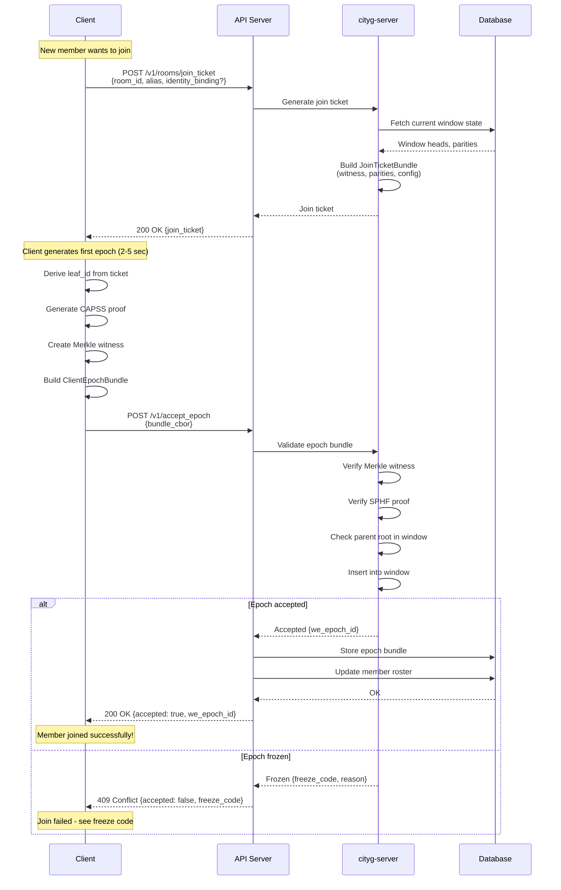

**Key Points:**
- Join ticket provides initial cryptographic material
- Client generates proof offline (no server interaction)
- Server validates all cryptographic proofs before accepting
- Identity binding is optional but recommended

### Detailed Join Flow (Bob's Perspective)

The following ASCII diagram shows the join flow from a new member's perspective, illustrating what Bob does step-by-step when joining a 7000-person group:

```
┌─────────────────────────────────────────────────────────────────┐
│              JOIN FLOW (Bob Joins 7000-Person Group)            │
└─────────────────────────────────────────────────────────────────┘

  Bob's Device                            Server
  (New Member)                        (Blind Validator)
       │                                     │
       │  1. Fetch group state               │
       │────────────────────────────-───────>│
       │   GET /groups/city-chat/state       │
       │                                     │
       │   Returns:                          │
       │   • parent_root (current members)   │
       │   • frontier (O(log N) hashes)      │
       │   • kbroad_pub (group key)          │
       │   • policy (e.g., "open_join")      │
       │<─────────────────────────────────-──│
       │                                     │
       │   Note: For 7000 members, frontier  │
       │   is ~13 hashes (log₂ 7000), not    │
       │   the full tree. Scales to millions.│
       │                                     │
       │  2. Bob creates anchor locally:     │
       │     • Adds his leaf_id to tree      │
       │     • Computes new_root (7001)      │
       │     • Generates hp, Y*, E_k         │
       │     • Creates proofs:               │
       │       - CAPSS Smallwood (≤16KB)     │
       │       - ZK-VRF (≤8KB)               │
       │     • Encrypts hp in KBROAD         │
       │     • Builds SRX witnesses          │
       │                                     │
       │  3. Submit anchor                   │
       │   POST /anchors                     │
       │   Body: complete anchor header      │
       │────────────────────────────-───────>│
       │                                     │
       │                                     │  4a. Crypto validation:
       │                                     │     (accept_anchor function)
       │                                     │     ✓ PoP signature valid?
       │                                     │     ✓ CAPSS Smallwood transcript valid?
       │                                     │     ✓ ZK-VRF proof valid?
       │                                     │     ✓ SRX witnesses correct?
       │                                     │     ✓ Merkle consistency?
       │                                     │     ✗ Never decrypts KBROAD
       │                                     │
       │                                     │  4b. Policy check:
       │                                     │     (your application code)
       │                                     │     ✓ join_leaf_ids.len()==1?
       │                                     │     ✓ Not in blocklist?
       │                                     │     ✓ Rate limit OK?
       │                                     │
       │                                     │     Accept & persist
       │  5. Success                         │
       │<────────────────────────────────-───│
       │                                     │
       │  6. Bob starts sending messages     │
       │     (encrypted with E_k)            │
       │                                     │

Bob knows: hp, Y*, E_k              Server knows:
Can read/write messages             • Merkle roots (7000→7001)
                                    • Bob's leaf_id: H(device_pk)
                                    • Timing metadata
                                    ✗ NOT hp, Y*, or E_k
                                    ✗ NOT Bob's device_pk
                                    ✗ NOT message content

Other 7000 members: Fetch anchor later, decrypt KBROAD, derive E_k
```

**Key insight**: Bob creates his own join anchor (he's the "publisher"). The server validates it cryptographically without learning secrets. No admin approval needed for open groups.

---

## Merge Flow

**Existing member resyncs after being offline**

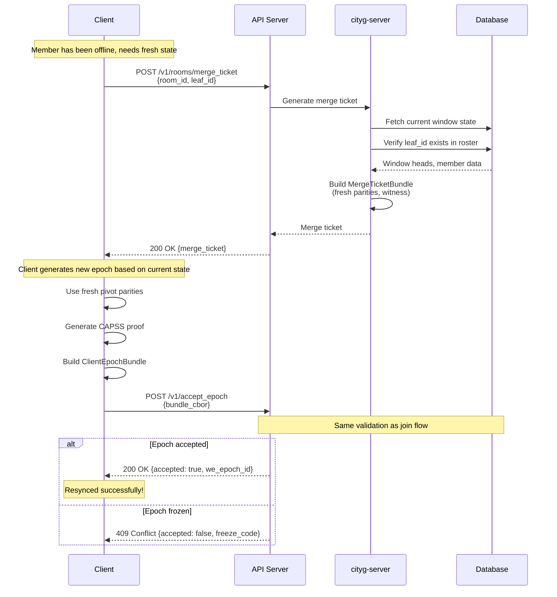

**Key Points:**
- Merge is for existing members (leaf_id already in roster)
- Fresh pivot parities ensure forward secrecy
- Current merge tickets encode requester self-revocation in `revoked_since`
- Accepted merge bundles therefore apply a leave/rekey-style roster delta

---

## Message Send and Receive

**Sending and fetching encrypted messages**

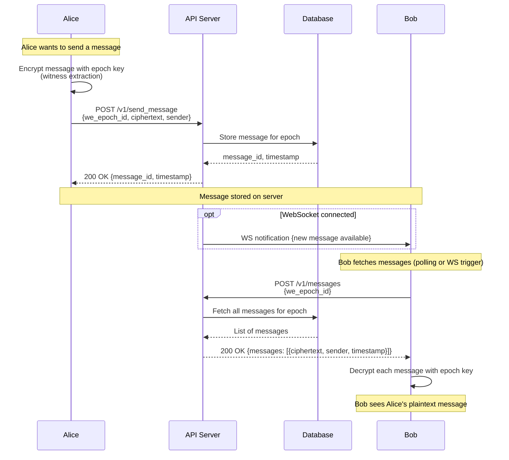

**Key Points:**
- Messages are encrypted client-side before sending
- Server stores ciphertext only (zero-knowledge)
- Any client with the epoch key can decrypt
- WebSocket provides instant notifications (optional)

---

## Epoch Acceptance

**Detailed validation pipeline for epoch bundles**

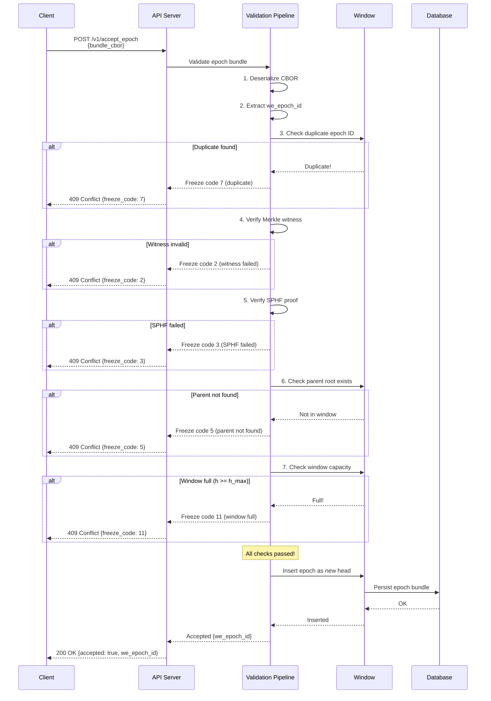

**Key Points:**
- Validation is multi-stage with specific freeze codes
- Each failure returns immediately (fail-fast)
- Window manages concurrency control (h_max)
- All epochs are persisted for future retrieval

---

## Forward Secrecy Pivot Rotation

**Automatic hourly pivot refresh for forward secrecy**

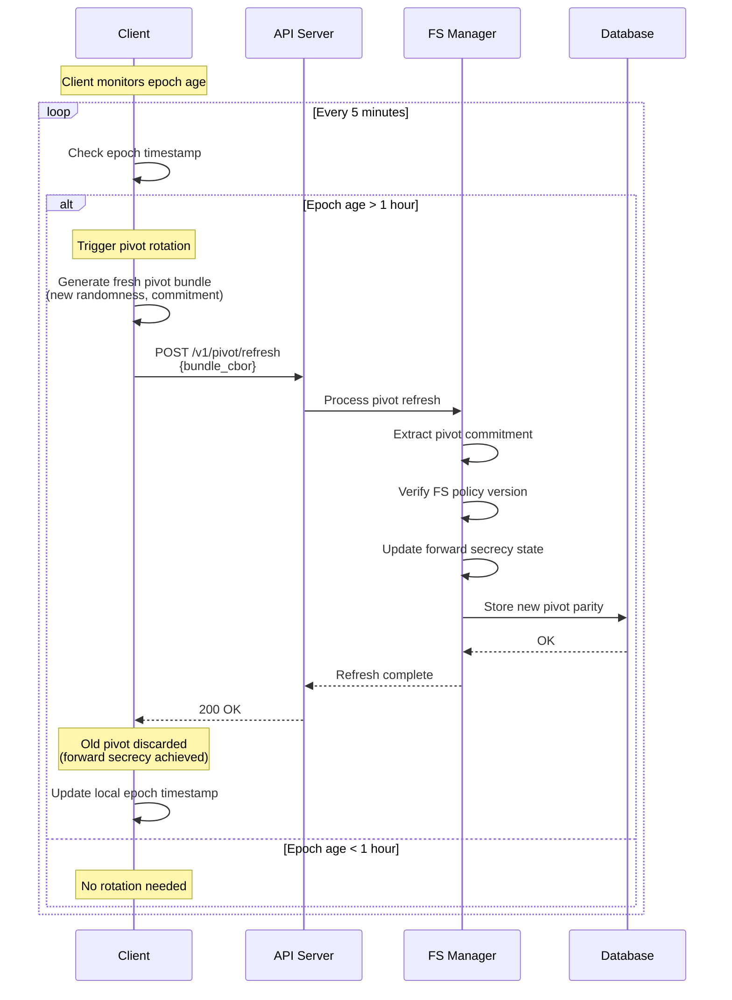

**Key Points:**
- Automatic rotation every hour (configurable)
- Old pivot keys are permanently discarded
- Ensures past messages remain secure even if current keys leak
- No user intervention required

---

## WebSocket Real-Time Notifications

**Real-time message delivery via WebSocket**

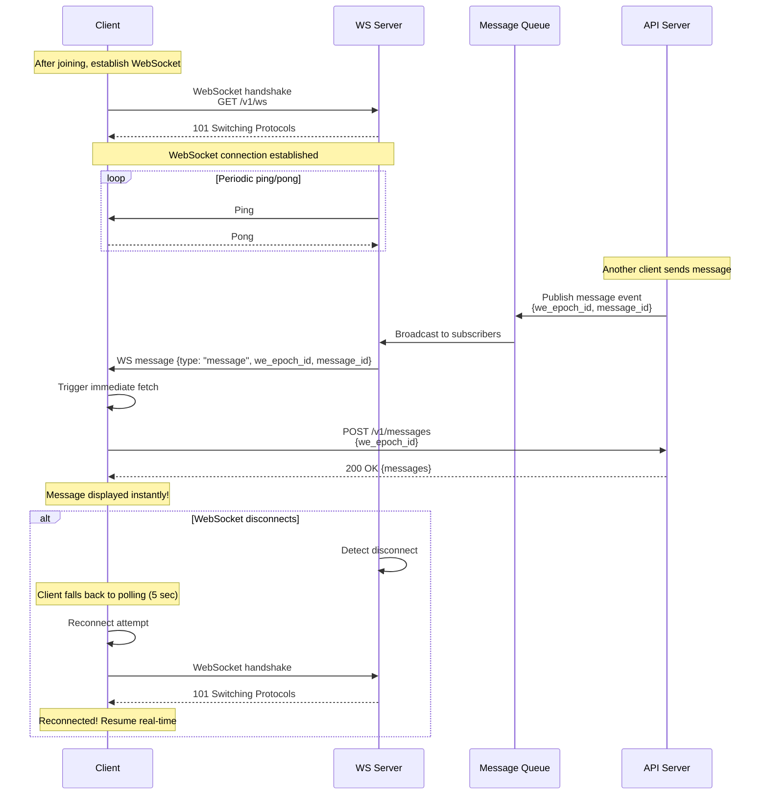

**Key Points:**
- WebSocket provides instant notifications (no polling delay)
- Client still fetches messages via HTTP (notification is just a trigger)
- Automatic reconnection on disconnect
- Fallback to polling if WebSocket unavailable

---

## Member Roster Query

**Fetching and searching group members**

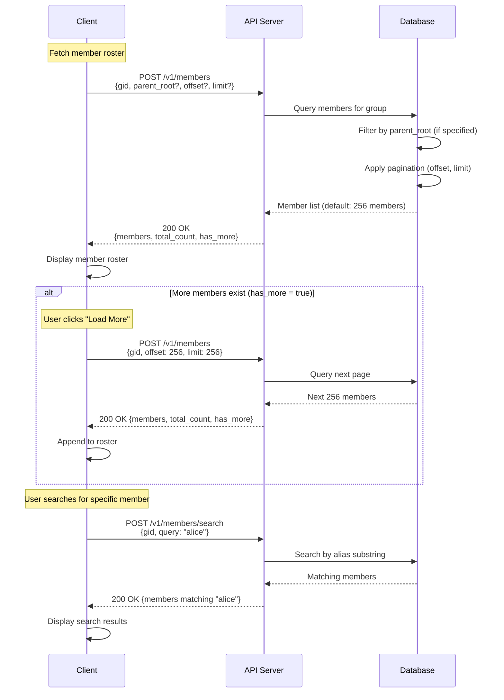

**Key Points:**
- Default pagination: 256 members per page
- Maximum limit: 2000 members per request
- Search supports alias substring and exact leaf_id hex
- `parent_root` filter for historical roster queries

---

## Complete Join-to-Message Flow

**End-to-end workflow from joining to sending a message**

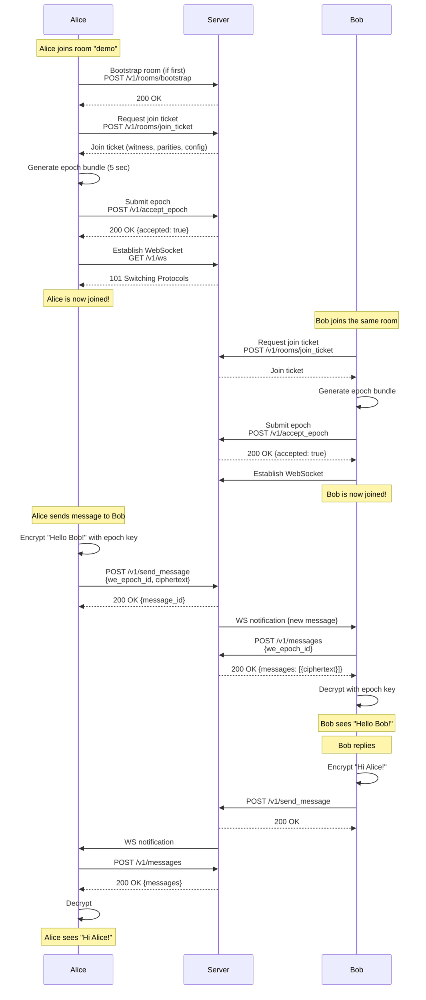

**Key Points:**
- First member bootstraps, others join directly
- Each member generates their own epoch bundle
- Messages are encrypted end-to-end (server cannot read)
- WebSocket provides instant delivery

---

## Error Handling Workflow

**How the system handles validation failures**

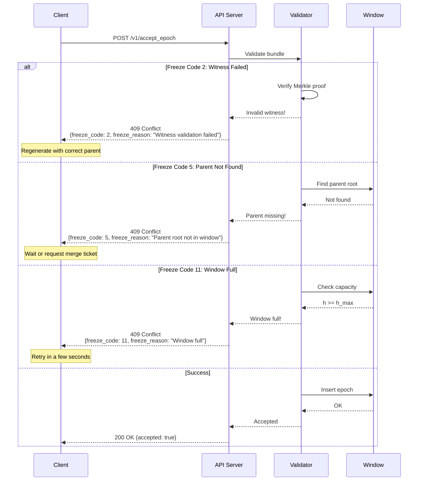

**Key Points:**
- Each freeze code has a specific meaning and recovery strategy
- Client should handle all freeze codes gracefully
- Some errors are transient (code 11) - retry works
- Some errors require corrective action (code 2, 5)

---

## Window Management

**How the multi-head window handles concurrency**

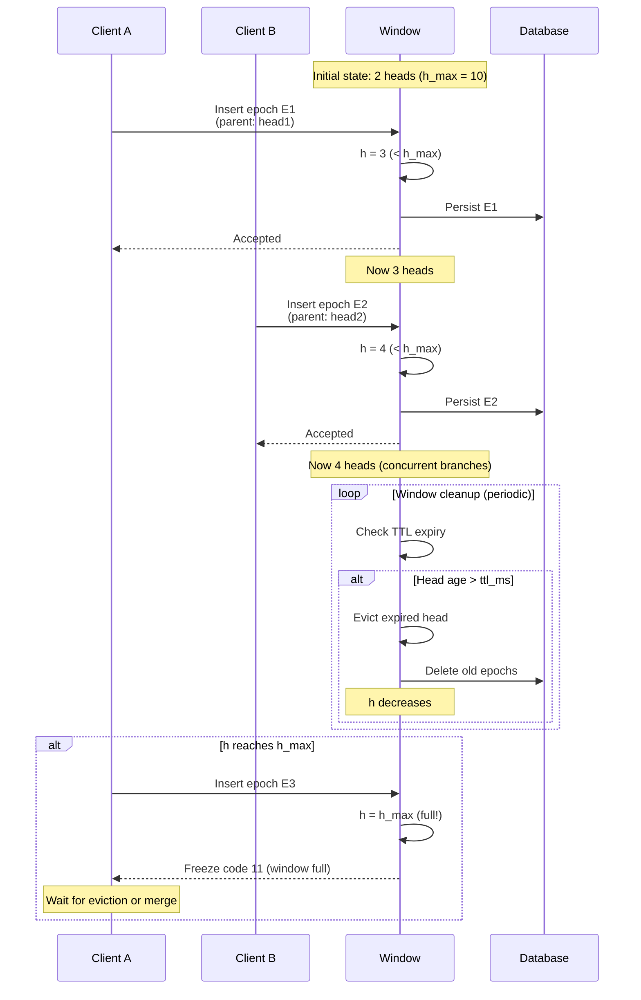

**Key Points:**
- Window allows `h_max` concurrent branches
- TTL evicts old heads automatically
- When full, clients must wait or merge branches
- This prevents unbounded memory growth

---

## Visual Guides

These diagrams provide educational overviews of key City-G concepts.

### Two Proof Systems

City-G uses two complementary zero-knowledge proofs that work together to enable server-blind validation:

```
┌──────────────────────────────────────────────────────────────────┐
│  CAPSS Smallwood Transcript (~12KB)  ZK-VRF Proof (≤8KB)         │
│  ───────────────────────────────     ──────────────────────────  │
│  "I derived hp deterministically     "Y* is correct and unique   │
│   and bound the FS context"          for this context"           │
│                                                                  │
│  Prevents: Grinding attacks          Prevents: Forgery           │
│  + FS tampering (mismatched epoch)   (Can't fake Y* values)      │
│                                                                  │
│  Server checks:                      Server checks:              │
│  ✓ seed → hp was deterministic       ✓ Y* exists and is valid    │
│  ✓ FS tuple matches header (146)     ✗ Learns nothing about Y*   │
│  ✗ Learns nothing about hp/epoch_sk                              │
└──────────────────────────────────────────────────────────────────┘

Both proofs verify correctness without revealing secrets.
```

**See also**: [Proof Systems](./protocol/06-proof-systems.md), [CAPSS README](../crates/capss/README.md), [LB-VRF README](../crates/msphf-lb-vrf/README.md)

### What the Server Sees (and Doesn't)

This diagram explains the server's view of an anchor and what remains cryptographically hidden:

```
┌─────────────────────────────────────────────────────────────────┐
│ Server's View of an Anchor                                      │
├─────────────────────────────────────────────────────────────────┤
│ ✓ SEES (Public Metadata):                                       │
│   • Merkle root transitions (parent → join_delta)               │
│   • Leaf IDs: H(device_public_key) [32-byte hashes]             │
│   • Number of members added/removed (from SRX witnesses)        │
│   • Timing: when anchor occurred                                │
│   • Structure: CBOR fields, proof sizes                         │
│   • xk_hash: commitment to anchor context (group+roots)         │
│                                                                 │
│ ✓ CAN EXAMINE (Validated Anchor Fields):                        │
│   • join_leaf_ids: which device hashes were added               │
│   • PoP signer: who created this anchor (leaf_id)               │
│   • Merkle delta: how many members added/removed                │
│   • SRX witness counts: membership proof counts                 │
│                                                                 │
│ ✓ CAN ENFORCE (Application-Layer Policy):                       │
│   • Group policy: open_join vs admin_only (your logic)          │
│   • Delta limits: reject if join_leaf_ids.len() > 1             │
│   • Rate limits: join frequency, abuse controls                 │
│   • Allow/block lists: check PoP signer against lists           │
│   • Cryptographic validity: accept_anchor validates this        │
│                                                                 │
│ ✗ NEVER SEES (Cryptographically Hidden):                        │
│   • hp (hash projection key) - encrypted in KBROAD              │
│   • Y* (VRF output) - hidden by ZK-VRF output-hiding            │
│   • E_k (epoch key) - derived client-side from Y*               │
│   • Device secret keys - only public keys transmitted           │
│   • Human identities - not part of protocol                     │
│   • Message content - encrypted with E_k                        │
└─────────────────────────────────────────────────────────────────┘

accept_anchor validates CRYPTOGRAPHY (proofs, signatures, witnesses).
Your application enforces POLICY (who can join, rate limits, etc.) by
examining validated fields. The server remains cryptographically BLIND
to secret keys (hp, Y*, E_k). Identity linking (leaf_hash → user) is
APPLICATION-LEVEL.
```

**See also**: [Security Model](./protocol/10-security-model.md), [Server Acceptance](./protocol/07-server-acceptance.md)

### Policy vs Cryptography

City-G separates cryptographic validation (protocol-level) from policy enforcement (application-level):

```
┌─────────────────────────────────────────────────────────────────┐
│ Application Policy Layer (Your Server Logic)                    │
├─────────────────────────────────────────────────────────────────┤
│ Examines accepted anchor BEFORE persisting:                     │
│                                                                 │
│ Group: "city-announcements"                                     │
│   ✓ join_leaf_ids.len() == 1?      ← Only 1 member per anchor   │
│   ✓ PoP signer not in blocklist?   ← Check against allow list   │
│   ✓ Rate limit check?              ← Join once per hour         │
│   → Accept self-joins              ← Open policy                │
│                                                                 │
│ Group: "executive-team"                                         │
│   ✓ PoP signer in admin_list?      ← Check Alice's leaf_id      │
│   ✓ join_leaf_ids.len() <= 10?     ← Bulk adds allowed          │
│   → Reject self-joins              ← Admin-only policy          │
│                                                                 │
│ Group: "alice-inbox"                                            │
│   ✓ Sender not already member?     ← First-time senders only    │
│   ✓ join_leaf_ids.len() == 1?      ← Personal inbox pattern     │
│   → Accept sender_once             ← Inbox policy               │
│                                                                 │
│ NOTE: Policy is NOT in accept_anchor() — you implement this     │
│ by examining the cryptographically-validated anchor fields      │
│ (join_leaf_ids, PoP signer, etc.) before storing it.            │
└─────────────────────────────────────────────────────────────────┘

┌─────────────────────────────────────────────────────────────────────┐
│ Cryptographic Validation Layer (accept_anchor)                      │
├─────────────────────────────────────────────────────────────────────┤
│ Protocol ALWAYS validates:                                          │
│   ✓ CAPSS Smallwood transcript: seed→hp deterministic + FS binding  │
│   ✓ ZK-VRF proof: Y* correctness (output-hiding)                    │
│   ✓ PoP signature: device key ownership                             │
│   ✓ SRX witnesses: Merkle proofs (membership/non-membership)        │
│   ✓ KBROAD structure: valid envelope (never decrypts!)              │
│   ✓ Merkle consistency: roots computed correctly                    │
│                                                                     │
│ AcceptanceOptions (coarse policy hooks):                            │
│   • allowed_srx_modes: e.g., ["srx/v1-complete"]                    │
│   • allowed_params_ids: cryptographic suite allow-list              │
│   • bootstrap_policy: genesis anchor rules                          │
│   • min_policy_version: reject stale policy versions                │
│                                                                     │
│ Protocol NEVER learns (cryptographically enforced):                 │
│   ✗ hp, Y*, E_k (even if server compromised)                        │
│   ✗ Message content                                                 │
│                                                                     │
│ accept_anchor returns: Accept | Freeze(error_code)                  │
│ → Your app decides: persist or reject based on group policy         │
└─────────────────────────────────────────────────────────────────────┘

Cryptography = "Are the proofs valid?" (accept_anchor always checks)
Coarse policy = "Are the suites/modes allowed?" (AcceptanceOptions)
Fine-grained policy = "Should I persist this anchor?" (your app logic)
```

**Example Policy Patterns:**

| Scenario | Who Creates Anchor | Server Policy Check | Server Crypto Check |
|----------|-------------------|---------------------|---------------------|
| Bob joins open community | Bob (self) | ✓ Policy allows open_join? | ✓ Proofs valid? |
| Bob joins private team | Alice (admin) | ✓ Alice is allowed_admin? | ✓ Proofs valid? |
| Bob sends to Alice's inbox | Bob (sender) | ✓ Policy allows sender_once? | ✓ Proofs valid? |
| Malicious actor tries to join | Anyone | ✗ Policy denies | ✗ Invalid proofs |

**See also**: [Client Operations](./protocol/08-client-operations.md), [Deployment Guide](./protocol/14-deployment-guide.md)

---

## See Also

- [API Reference](./api-reference.md) - Complete HTTP API documentation
- [Protocol Documentation](./protocol/00-README.md) - Cryptographic protocol details
- [Error Reference](./protocol/12-error-reference.md) - Complete freeze code catalog
- [GUI User Guide](./gui-user-guide.md) - Desktop application guide

---

**Last Updated:** 2025-11-06
**Protocol Version:** v1
